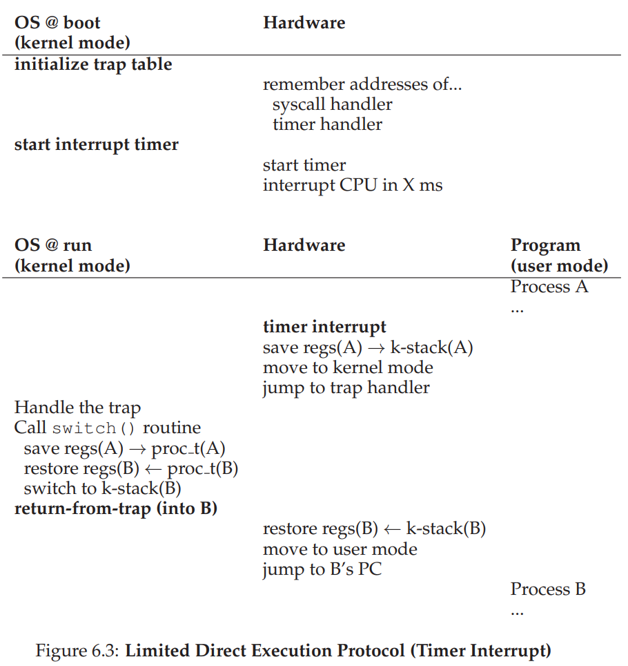
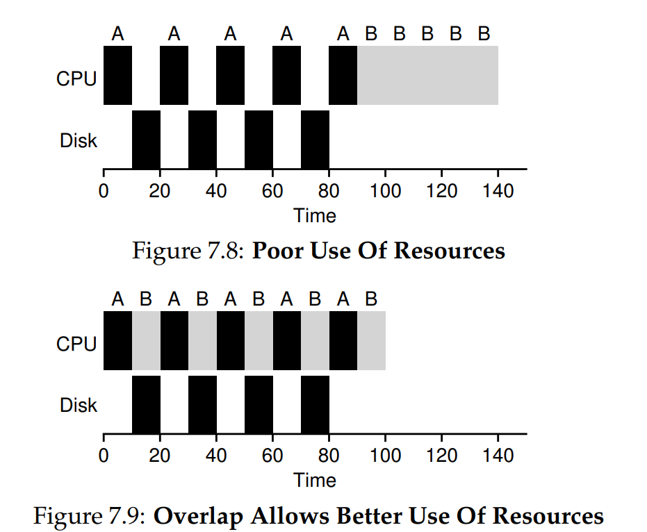
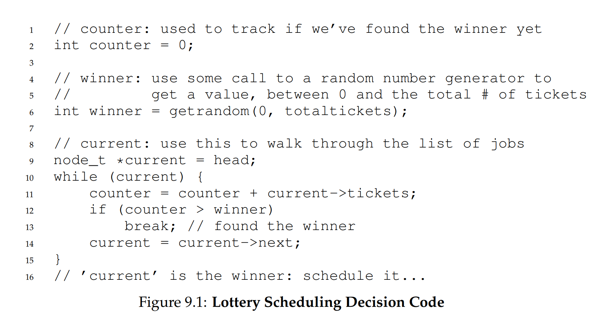
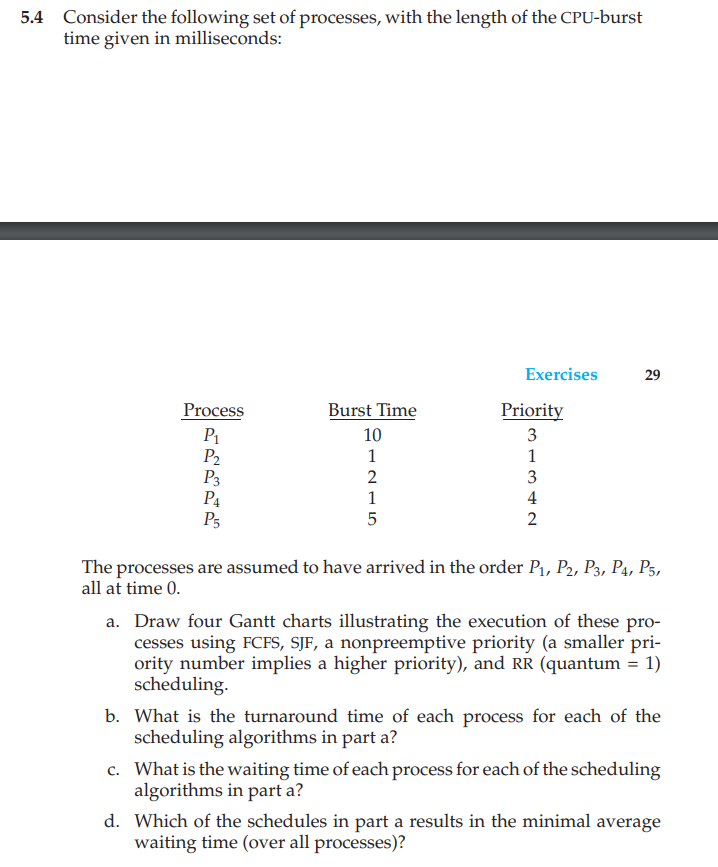
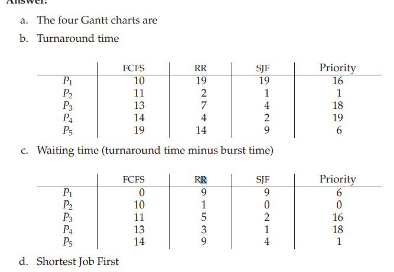
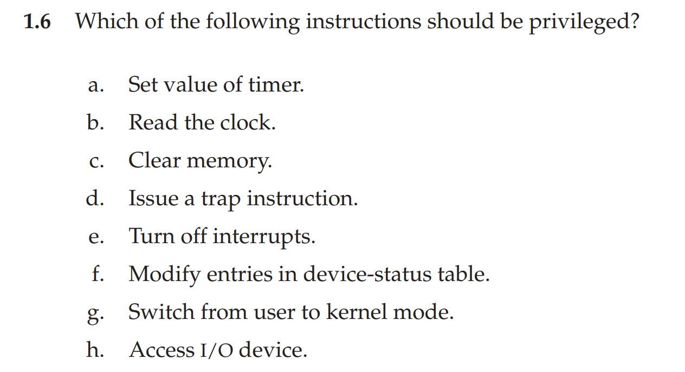
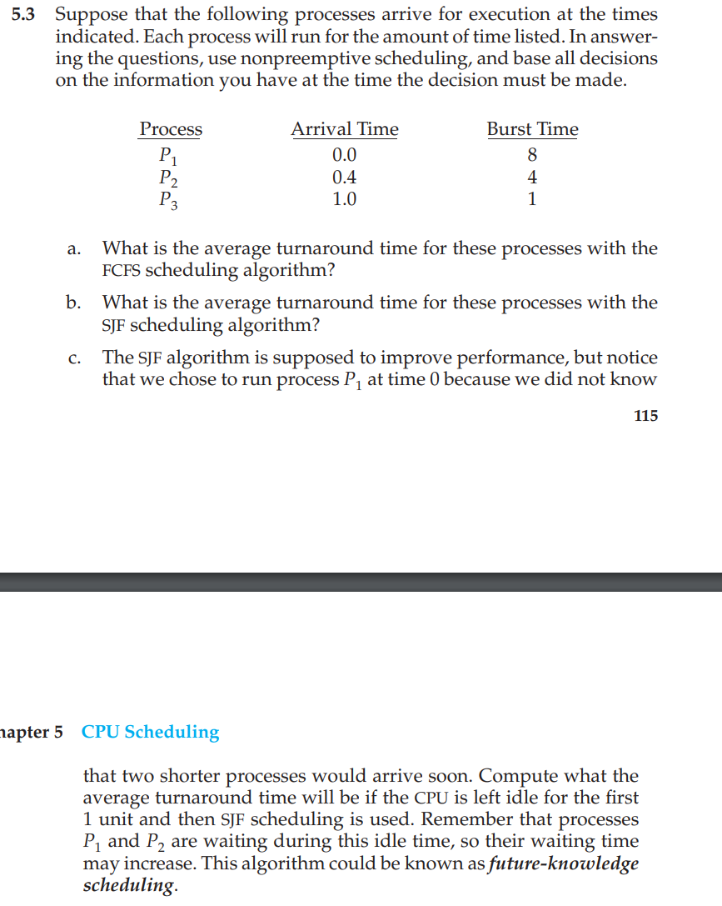
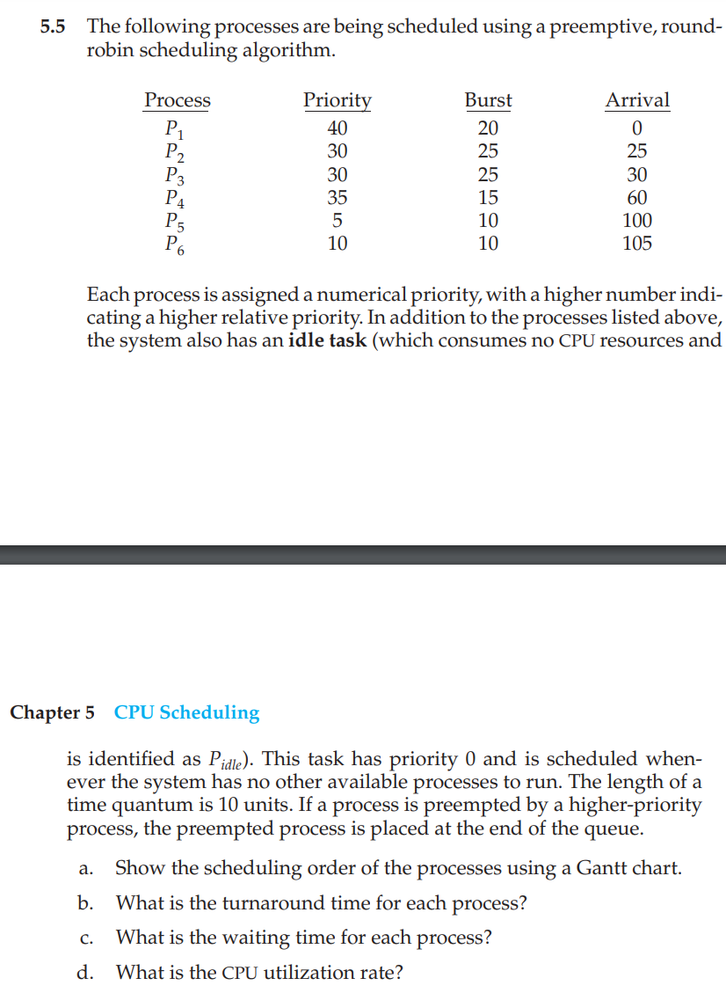
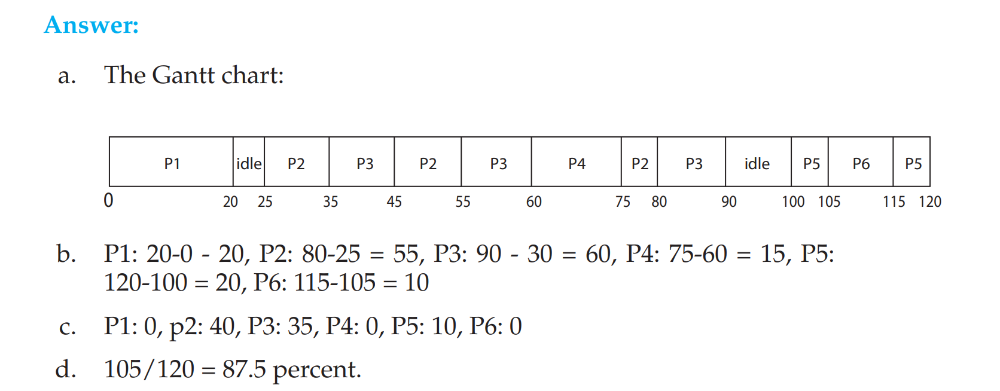

## What are the goals of an OS 
- Resource virtualisation - provides an abstraction 
- Resource management
- Provide a high level API for user to interface with the resources 

## Abstraction that the OS provides Processor, Memory, Disks, Network, Machines 
- Processor - threads 
- Memory - address space 
- Disks - file
- Network - socket 
- Machine - processes 

## Pros of Abstraction
- Allows for reuse 
- Provides uniform user interface 
- Provides high level functionality 

## Cons of Abstraction 
- What are the correct abstractions 
- How much hardware to expose 

## Pros of Resource Management 
- Protect applications from one another 
- Provide efficient access to resources 
- Provide fair access to resources 

## Challenges of Resource Management 
- Correct mechanisms 
- Correct policies

## What is a process 
- Process is an execution stream in the context of a process state 

## What is an execution stream
- Stream of executing instructions running a piece of code 

## What is a process state 
- Everything that the running code can be affected by 
    - Registers, program counter, stack pointer, address space, heap, stack, code, open files 
    - Floating point, status 

## Difference between a process and a thread 
- Thread is a light weight process 
- Thread is an execution stream that shares an address space 
- There can be multiple threads within a single process 

## Describe the process of process creation 
- Load code and static data from disk into memory 
- Initialise the address space - stack and heap 
- Intialise I/O - i.e. for Linux 3 file descriptors stdin, stdout, stderr
- Start entry point at `main()`

## What are the different process states, draw diagram 
- Ready 
- Running 
- Blocked 

ready -> running: schedule
running -> ready: descheduled
running -> blocked -> IO started
blocked -> ready -> IO completed 

## What is direct execution? 
Allows process users to run directly on hardware.

## Issues with direct execution? 
- We don't want everyone to be able to access files they don't have permission to (restricted operations). 
- Malicious process may not return control back to the OS 
- Not optimal utilisation of resources - i.e. blocking IO 

## What is limited direct execution
Instead of allowing user process to run directly on the hardware, the OS maintains some control 

## How does limited direct execution ensures restricted operations
- Different processor modes - user mode and kernel mode
- Codes run in user mode is restricted in what it can do - i.e. cannot do IO request
- Codes run in kernel mode can perform privilege actions 

## When the computer first boots, what is its mode.
Kernel mode. When user program begins, changes to user mode

## How can programs in user mode perform privilege operations? 
- Through system calls. 
- To execute a system call, begin a `trap` instruction - an interrupt
- Raises privilege level to kernel mode. 
- To return from kernel mode, the OS calls a `return-from-trap` instruction

## What are the different types of kernel mode transfer 
- Syscall 
- Interrupt 
- Trap or exception 

## What are syscall
- When a process requests a system service
- The current process does not have the address of the syscall function.
- The system call number and arguments are loaded to registers to be executed. 

## What are interrupt events
- External async event that triggers context switch 
- Timer or I/O 
- Independent of user processes 

## What are traps or exceptions 
- Internal synchronous events that trigger context switch 
- i.e. segmentation fault

## What is a kernel stack 
- For each process there is a kernel stack 
- The kernel stack contains the process' context information like 
program counter, flags, registers.
- When executing a trap, the processor will push context information to the kernel stack.
- After executing a syscall, the return-from-trap will pop these values and resume the program's execution. 

## How does the trap know which code to run for syscalls?
- The kernel sets up a trap table at bootime.
- Configure what code to run when exceptional events occur - i.e. trap handlers
- i.e. system calls, keyboard interrupt, etc. 
- Once configured, the hardware remembers the location of the trap handlers until next reboot, and knows what to do to handle exceptional events. 
- Each system call has an associated system-call number. 
- User program puts the desired system call number to a register and the trap handler will execute the system call in kernel mode. 

## How does limited direct execution ensures switching between processes 
Through non-cooperative approach, in which the OS wrestles control from a running program through system calls, exceptional events, or timer-interrupt events. 

## What is the distinction between policy and mechanism 
Policy - what process to run and when. To optimise a metric 
Mechanisms - how to perform context switching 

## Describe the cooperative approach and issues associated with it
### Mechanism
- The OS trusts the processes to frequently give up control to the OS 
- Control is transferred via making system calls/encountering exceptions
- For long running program that does not perform system call, control is transferred explicitly via a `yield` system call that does nothing but give up control. 
- OS waits for a system call/exception from a running process to regain control. 

### Issues 
Control cannot be regained without hardware support. May need to reboot if a program runs forever without making system calls. 

## Describe the non-cooperative apprach 
OS periodically regain control via a timer-interrupt, which triggers an interrupt event every X ms. For this, at start up, the OS must configure the timer as a privilege operation, and setup a trap handler for timer interrupt event. 

## How does the OS perform a context switch 
- A process triggers a trap
- The OS decides to let another process run
- Save registers for the currently executing process onto its kernel stack. 
- Restore the soon-to-be-executing process's register onto the stack. 
- When a return-from-trap call is performed, the swapped in process resumes. 

## How does the OS save the context of a running process 
- Save (running process - A)
    - General purpose registers
    - Program Counter, 
    - Kernel stack pointer
- Switch the kernel stacks 
    - Save registers to `proc_t` of A 
    - Restore registers from `proc_t` of B
    - Set stack pointer to use B's kernel stack 
- Restores (to be run process - B)
    - Registers 
    - Program Counter
    - Kernel stack pointer 

## What are the two types of register save/restore during context switch 
- User registers - saved by the hardware into the kernel stack of that process. Happens at timer interrupt 
- Kernel registers - saved by the software into memory in the process structure of the process. 

## What context must be saved - stored in PCB
- PID 
- State (running/blocked/etc)
- Execution state - registers, PC, stack pointer 
- Scheduling prioirty 
- Accounting information (child/parent)
- Credentials
- Pointers to other allocated resources (open files)

## What is the difference between a Dispatcher and a Scheduler
- Dispatcher - low level mechanism to perform context swith 
- Schedule - policy to determine which process gets CPU 

## What is turn around time 
Time completes - Time arrived

## What is response time
Time first runs - Time arrived

## Find average turn around time FIFO - 3 jobs A,B,C each taking 10 seconds to run and each arriving at time 0.

Turn around time on average is (10+20+30)/3 = 20 s

## Find average turn around time FIFO - 3 jobs B,C each taking 10 seconds to run and each arriving at time 0. Job A also arrives at t=0 but takes 100 seconds to complete.

Turn around time on average is (100+110+120)/3 = 110 s

## Describe the convoy effect 

Relatively short processes get queued behind a long process. 

## Find average turn around time Shortest Job First (SJF) - 3 jobs B,C each taking 10 seconds to run and each arriving at time 0. Job A also arrives at t=0 but takes 100 seconds to complete.

Turn around time on average is (10+20+120)/3 = 50s

## Find average turn around time Shortest Job First (SJF) - A arrives at t=0 and runs for 100s, B and C arrives at t = 10 and runs for 10s: 

Turn around time on average is (100+ (110-10)+(120-10))/3 = 103.3s

## What situation does SJF perform badly?

When the longest jobs arrive first and the shortest jobs arrive last

## What is the difference between pre-emptive and non-preemptive scheduling?

Non-preemptive: once a job is started, it runs to completion

Pre-emptive: a job can be stopped to make space for a job such that the metric is optimised. 

## Find average turn around time Shortest Time to Completion First (STCF) - A arrives at t=0 and runs for 100s, B and C arrives at t = 10 and runs for 10s

A starts for 10s, then stops, makes space for B and C. The average response time is: (10 + 20 + 120)/3 = 50s

## Find examples of Pre-emptive and Non-preemptive scheduling algorithms 
Pre-emptive: STCF
Non-preemptive: FIFO, SJF

## Given an example of 3 jobs A, B, C arriving at the same time and that they each wish to run for 5 seconds. Describe the difference between SJF and RR in average time to completion and response time 

SJF: 
Time to completion: (5+10+15)/3 = 10s
Response time: (0 + 5 + 10)/3 = 5s

RR:
Response time: (0 + 1 + 2) = 1 s
Time to completion: (13+14+15)/3 = 14s

## Why is context switching expensive?

Because when running, a lot of prediction data - i.e. TLB, CPU caches, branch predictors are flushed, hence will take time to rebuld and hence expensive. 

## What is a fair scheduling policy:

Every process is allocated an equal portion of the CPU time slice

## What is the strategy for dealing with programs that frequently uses IO: 

Treat IO job as separate CPU bursts. Since each CPU job is shorter than B, A is scheduled first under STCF. Job A pre-empts job B.

## What is the goal of Multi-level feedback queue 

Support two job types with distinct goals:
- interactive: response time 
- batch: turnaround time 
Approach: multiple levels of round-robin. Each level has higher priority than lower levels and preempts them.

## List all the rules of MLFQ

- If Priority(A) > Priority(B), A runs and B doesn't
- If Priority(A) = Priority(B), A and B run in round robin
- When a job enters the system, it has the highest priority
- Once a job uses up its time allotment, its priority is reduced
- After some time period S, move all jobs in the system to topmost queue

## How does MLFQ assign priority

- From user input with niceness 
- From an adaptive scheme 

## What are some of the possible issues with MLFQ 
- Starvation
- Some processes gaming the system

## How does MLFQ ensures that interactive jobs will always get high priority
Use rule number 3, a job has its priority reduced if it uses up its timeslice. Since interactive jobs are treated as CPU burst, the timeslice is never used up, hence always high in priority. 

## How does a process potentially game the MLFQ 

Performs IO right before the end of high priority. 

## How does MLFQ prevents gaming the system

If a process uses up its timeslot, its priority is demoted, regardless of whether it gives up IO or not. 

## How does MLFQ prevent starvation
Periodically, all jobs are placed to the top of the priority queue. 

## Define starvation
When some processes never get allocated any allotment. 

## Describe the idea behind proportional share 

Guarantee that each job gets a proportional of the CPU share. Tickets are used to represent shares. Processes that have higher priority hold more tickets get to run more. 

## How is the ticket winner get chosen 
A winner value is randomised. Counter is set from 0 and incremented for each process by the number of ticket. If the counter at any round is greater than winner value, the winning process gets run. 

## How does Linux Completely Fair Scheduler work?

- All tasks have the same priority. There are always T tasks ready to run any moment, each task get 1/T of the resources
- Try to simulate each task running simultaneously but at 1/T the CPU clock speed. 
- A real CPU can only run 1 single task at once, so a task will be ahead or behind its 1/T allotment.
- CFS tracks how long each task has run, and during a scheduling decision, picks the task with lowest run time so far. 

## What is the data structure used in Red Black Tree and why does it work

- Self-balancing - insertion and deletion ensure that the longest tree path is at most twice the length of any path.
- All operations take O(logN) time
- Every node is associated with a task with its runtime.
- When a task gets run, its node is removed from the tree.
- When the scheduler picks a task to run, it chooses the left most node (lowest run time). 
- After the task has been run, it is reinserted to the tree. 

## How does nice work 

Negative -> higher priority 
Positive -> lower priority 
There are different priority levels 

## What is the purpose of interrupts? What are the differences between a trap and an interrupt? Can traps be generated intentionally by a user program? If so, for what purpose?
Answer: An interrupt is a hardware-generated change-of-flow within
the system. An interrupt handler is summoned to deal with the cause
of the interrupt; control is then returned to the interrupted context and instruction. A trap is a software-generated interrupt. An interrupt can be used to signal the completion of an I/O to obviate the need for device polling. A trap can be used to call operating system routines or to catch arithmetic errors.

## The services and functions provided by an operating system can be divided into two main categories. Briefly describe the two categories and discuss how they differ.

Answer: One class of services provided by an operating system is to
enforce protection between different processes running concurrently in
the system. Processes are allowed to access only those memory locations
that are associated with their address spaces. Also, processes are not
allowed to corrupt files associated with other users. A process is also not allowed to access devices directly without operating system intervention. 

The second class of services provided by an operating system is to
provide new functionality that is not supported directly by the underlying hardware. Virtual memory and file systems are two such examples of new services provided by an operating system

## Why is the separation of mechanism and policy desirable?
Answer: Mechanism and policy must be separate to ensure that systems
are easy to modify. No two system installations are the same, so each
installation may want to tune the operating system to suit its needs.
With mechanism and policy separate, the policy may be changed at will
while the mechanism stays unchanged. This arrangement provides a
more flexible system.

## Why is it important for the scheduler to distinguish I/O-bound programs from CPU-bound programs?
Answer: I/O-bound programs have the property of performing only
a small amount of computation before performing IO. Such programs
typically do not use up their entire CPU quantum. CPU-bound programs, on the other hand, use their entire quantum without performing any
blocking IO operations. Consequently, one could make better use of the
computer’s resouces by giving higher priority to I/O-bound programs
and allow them to execute ahead of the CPU-bound programs.

## Discuss how the following pairs of scheduling criteria conflict in certain settings. a. CPU utilization and response time b. Average turnaround time and maximum waiting time c. I/O device utilization and CPU utilization
Answer:

• CPU utilization and response time: CPU utilization is increased if the overheads associated with context switching is minimized. The
context switching overheads could be lowered by performing
context switches infrequently. This could however result in
increasing the response time for processes.

• Average turnaround time and maximum waiting time: Average
turnaround time is minimized by executing the shortest tasks first.
Such a scheduling policy could however starve long-running tasks
and thereby increase their waiting time.

• I/O device utilization and CPU utilization: CPU utilization is
maximized by running long-running CPU-bound tasks without
performing context switches. I/O device utilization is maximized by
scheduling I/O-bound jobs as soon as they become ready to run,
thereby incurring the overheads of context switches.

## Which of the following scheduling algorithms could result in starvation? a. First-come, first-served b. Shortest Job first c. Round Robin d. Priority

Priority - i.e. new high priority jobs keep entering the queue 
Shortest Job First

## Answer the following question: 

## Answer the following 

Operations that require kernel mode: 
- set timer
- clear memory 
- turn off interrupts
- modify entries in device status table 
- switch user and kernel 
- access IO 

## What is the purpose of system calls?

Allows user process to request OS services 

## Explain the difference between preemptive and nonpreemptive scheduling.
Answer:
Preemptive scheduling allows a process to be interrupted in the midst of
its execution, taking the CPU away and allocating it to another process.
Nonpreemptive scheduling ensures that a process relinquishes control
of the CPU only when it nishes with its current CPU burs

## Suppose that a CPU scheduling algorithm favors those processes that have used the least processor time in the recent past. Why will this algorithm favor I/O-bound programs and yet not permanently starve CPU-bound programs?
Answer:
It will favor the I/O-bound programs because of the relatively short
CPU bursts requested by them; however, the CPU-bound programs will
not starve, because the I/O-bound programs will relinquish the CPU
relatively often to do their I/O.

## What advantage is there in having different time-quantum sizes at different levels of a multilevel queueing system?
Answer:
Processes that need more frequent servicing— for instance, interactive
processes such as editors—can be in a queue with a small time quantum.
Processes with no need for frequent servicing can be in a queue with
a larger quantum, requiring fewer context switches to complete

## Answer the following question

a. (8+12-0.4+13-1)/3=10.53

b. (8+9-1+13-0.4)/3=9.53

c. (1+6-0.4+14)/3=6.87

## Answer the following question

## What is multiprogramming 

Instead of just running one job at a time, the OS would load a number of jobs into memory and switch rapidly between them, thus improving CPU utilization

## Why is multi-programming important 

Because IO devices were slow and waiting on IO is a waste of CPU resources 

## What is waiting time 

Time the process spent ready in a queue

## What is throughput 

Number of processes completed per time unit. 

## What are the considerations required in designing a Round Robin Scheduling Algorithm? 

- Consider time quantum size. Too small a quantum size leads to very frequent context switches, which can be very expensive.
- Too large a quantum size then response time is increased. 
- Therefore, we want quantum size time to be large w.r.t context switch time. If context switch time is 10\% time quantum, then 10\% of CPU time is spent on context switching. 
- On the other hand, we don't want time quantum to be too large w.r.t context switch time, otherwise it becomes FCFS. 
- Rule of thumb: 80% of CPU burst should be shorter than time quantum

## What is the rationale for having varying time-slice length across different queues?

High priority queues are given short time slices - usually comprised of interactive jobs. 

Low priority queues contain long running jobs that are CPU bound. 

Hence interactive jobs can have high priority without starving other processes. Batch jobs can be run without expensive context switching. 

