## Do threads share the same address space 

Yes 

## Do threads share the same registers?
No

## Why is context switching in threads less expensive than in processes?

The same address space so there is no need to save and change the address space pages and page table

## Do threads share the same stack? 

No 

## Why use threads? 

- Parallelism 
- Avoid blocking program due to slow IO 

## What is a practical challenge of working with thread 

- Thread scheduling is done by the OS which is not available to user 
- Poor scheduling results in concurrency issues 
    - Race condition
    - Dead lock 

## What is race condition

When multiple threads updating a shared variable, the outcome depends on the timing execution of the code.

## What is a critical section

Code section that must be executed by one thread at a time 

## What is mutual exclusion 

A property that guarantees if one code is executing the critical section, other threads will be prevented from doing so

## What is atomic operation 

All or nothing, either all updates in an atomic operation are sucessful or not 

## What is a transaction 

Single atomic operation 

## What is an indeterminate program

Program consisting of one or more race conditions, causing the outcome to vary from run to run 

## What are synchronisation primitives 

Set of hardware supported instructions to provide atomicity 

## What is the purpose of using a lock 

Annotate a critical section to make it atomnic. 

## What is the syntax for using a lock 

- Acquire a lock (`lock`)
- Run the critical section
- Release the lock (`unlock`)

## Can multiple thread holds the same lock 

No 

## How can the lock be used by threads other than the owner

If the owner releases the lock (call `unlock`)

## What is the difference between fine-grained and coarse-grained locks?

Coarse-grained - one big lock to lock an object everytime a critical section is entered 

Fine-grained - locks for different variables providing more control 

## How can disabling interrupt allows atomicity in single processor

By disabling interrupt, context switching is disable, ensuring that only one thread enters the critical section

## What are the issues with disabling interrupt 

- Does not work for multi-processors computers: threads will be able to run on other processors and enter the critical section. 

- Require trust for the program which might be abused (giving the program privilege)
    - Does not give back control
    - Access protected address space 

- Lost interrupt - i.e. IO interrupt 

## Where is disabling interrupt use

By the OS w.r.t its own data structure 

## Describe the issue with the following implementation of a lock 

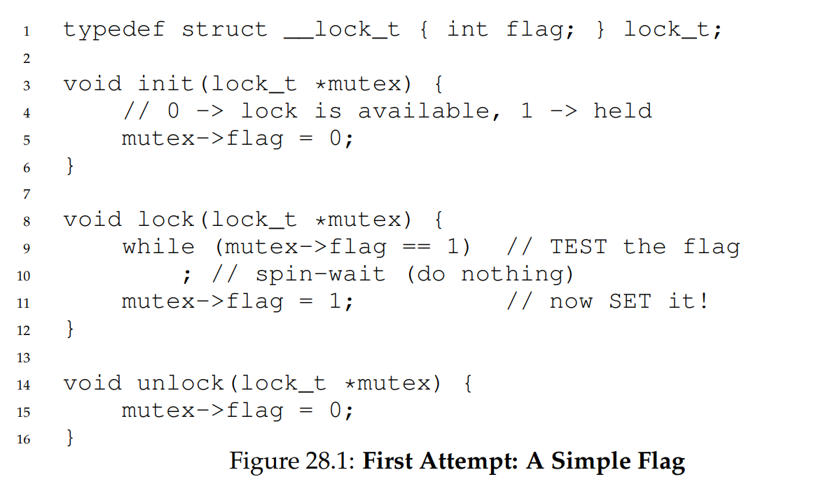

Not atomic, some operations can interleave between the lock method 

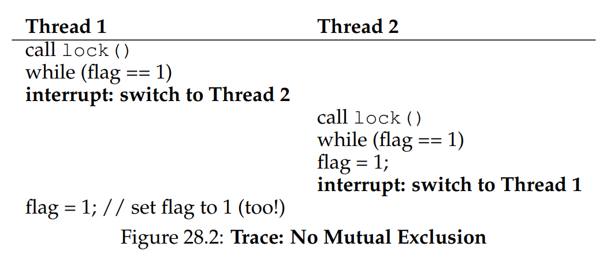

## What is spin-waiting 

Check for lock condition then wait until the condition is passed. 

## What is the issue with spin waiting 

Wasting CPU cycle 

## What is test and set

Atomic operation with hardware support.

## What are the inputs, outputs and operations of test and set 

Input: - pointer to old value, new value

Output - old value 

Operations - set new value to old value pointer 

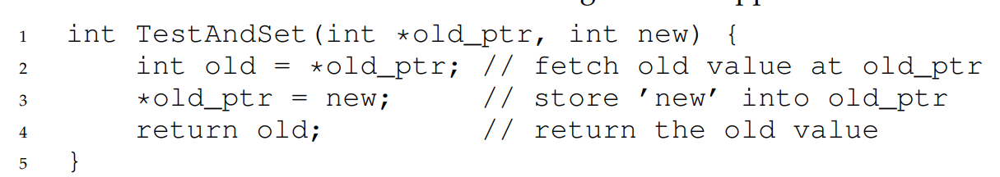

## How is test and set used for lock 

Check `while(TestAndSet(lock->flag, 1)==1)`

If initially the lock is used - i.e. flag is 1, the condition evaluates to true and spin-waits. If the lock is not in used, perform a check and set as a single atomic operation. 

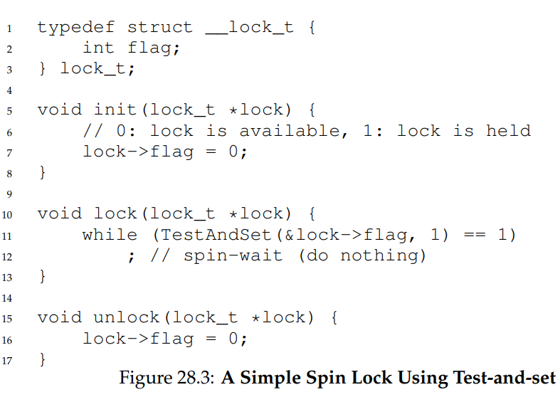

## Why does spin lock require a pre-emptive scheduler on single core processor?

Otherwise it will spin in-place and the thread that acquires the lock will not get scheduled.

## Does spin lock ensure fairness?

No. A thread may spin forever under contention and thus lead to starvation. 

## What is the cost of using spin lock for single processor?

A thread that runs spin lock will do nothing for its entire timeslice.

## What is the cost of using spin lock for multiple processor?

Not as sever but is still wasteful. 

## Describe the compare and swap primitive w.r.t input, output and operations 

Input: pointer to lock variable, expected value, swapped value 

Output: pointer old value 

Operation: 
    - check if lock variable equals expected.
        - If true, swap value with swapped value 
    - returns old value 

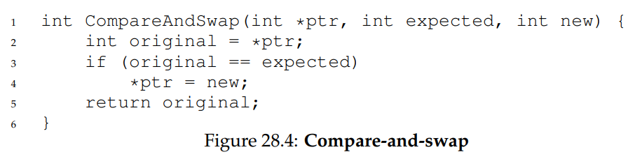

##  How is compare and swap used to implement spin lock 

Run `while(CompareAndSwap(lock, 0, 1) == 1)`

If initially is free, then condition equals expected value (0), then the lock is set to 1 and gets past the spin wait. If not free, spins in place. 

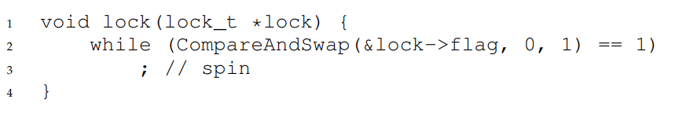

## What is the idea behind load link and store conditional

- Referencing the interleave operation if hardware support is not used, the issue might be when the lock value is read, and interleaved operation happens which updates the lock value, causing correctness issue.

- Load Link and store conditonal solves the problem by checking whether there is any change to the value since it was last read. 

## What are the inputs, output and operations of load link and store conditional

Load Link - input - flag, output - flag value - simply read the value 

Store Conditonal:
    - Input: ptr, new value 
    - Output - 1: success if no update since last read, 0: failure 
    - Operation: 
        - Checks if the value of flag has been modified since it was last read.
        - If true
            - Set flag to value and return 1 
        - Return false 

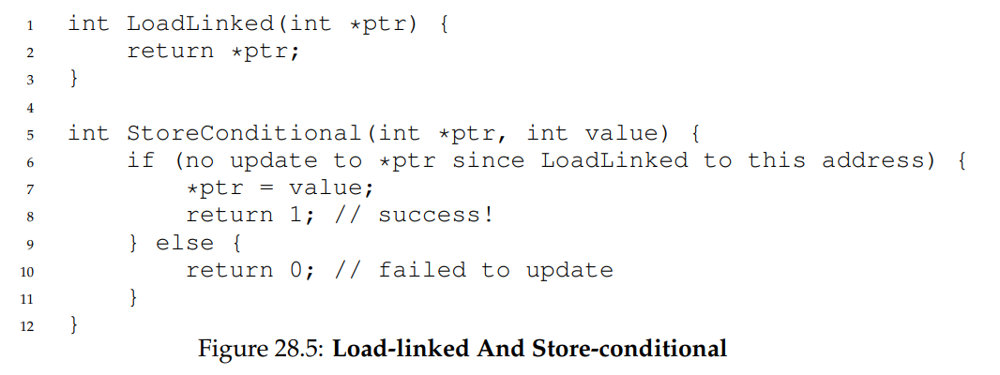

## How is load link and store conditonal use

`while (LoadLink(flag)==1 ||!StoreConditional(flag, 1))`

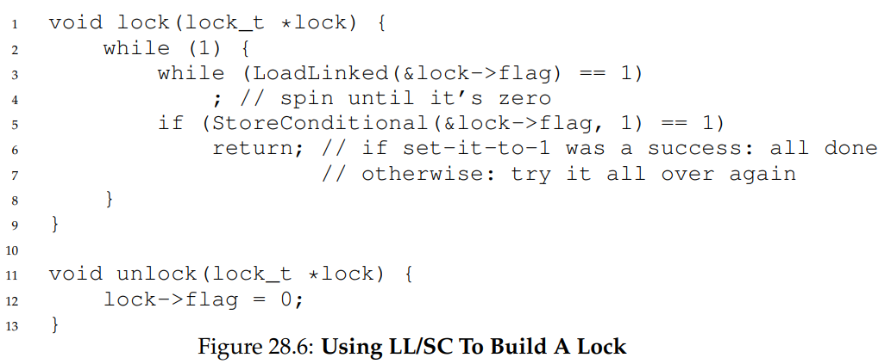

## What is the input, output and operation of FetchAndAdd 

Similar to the value of i++ (return i then increment i)

## How is FetchAndAdd used to implement ticket lock 

- Lock data structure has `ticket` and `turn` variables. 
- When each thread initialises, they register their id using the fetch and add operation on the `ticket` variable.
- Each thread then checks whether the `turn` variable is equals to its id. It holds the lock if it does.
- When unlocking, move to the next turn - i.e. fetch and add the turn variable.

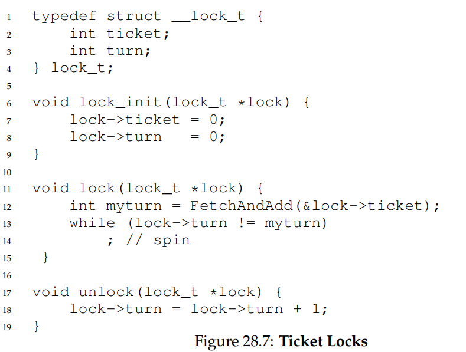

## What is an improvement of ticket lock

Allows every thread to run 

## For a spin lock on single processor, if there are N threads in contention for a lock, how many time slices are wasted?

N - 1 since only 1 thread can acquire the lock at a time and do useful work. The remaining N - 1 threads spin and do nothing 

## Describe the idea of yield 

When a thread that spin-waits get scheduled, it performs a system call `yield` to give back control to the OS to schedule other threads. 

## For a spin lock on single processor using yield primitive, if there are N threads in contention for a lock, describe the costs?

N - 1 context switches, which is less than 99 spin-waits but is still substantial 

## How does park and unpark primitives save the cost of context switch 

- Do not schedule threads that wait for lock release until the lock is free 

## What does `park` and `unpark` primitives do

- `park` - sleep: put the current thread into a queue 
- `unpark` - when lock flag becomes available, wake up sleeping threads 

## Describe the operation involving `park` and `unpark` w.r.t `lock` and `unlock`

- For `lock`:
    - Spinlocks to wait for guard.
    - If flag is used:
        - Put self in a queue
        - Release guard 
        - `park`
    - If flag is not used:
        - Set flag to 1 - used 
        - Release guard 
        - Perform critical section

- For `unlock`
    - Spinlocks to wait for guard
    - If queue is empty
        - Flag is set to 0 
        - Release guard
    - If queue is not empty 
        - Dequeue and wake up (unpark)
        - Release guard 

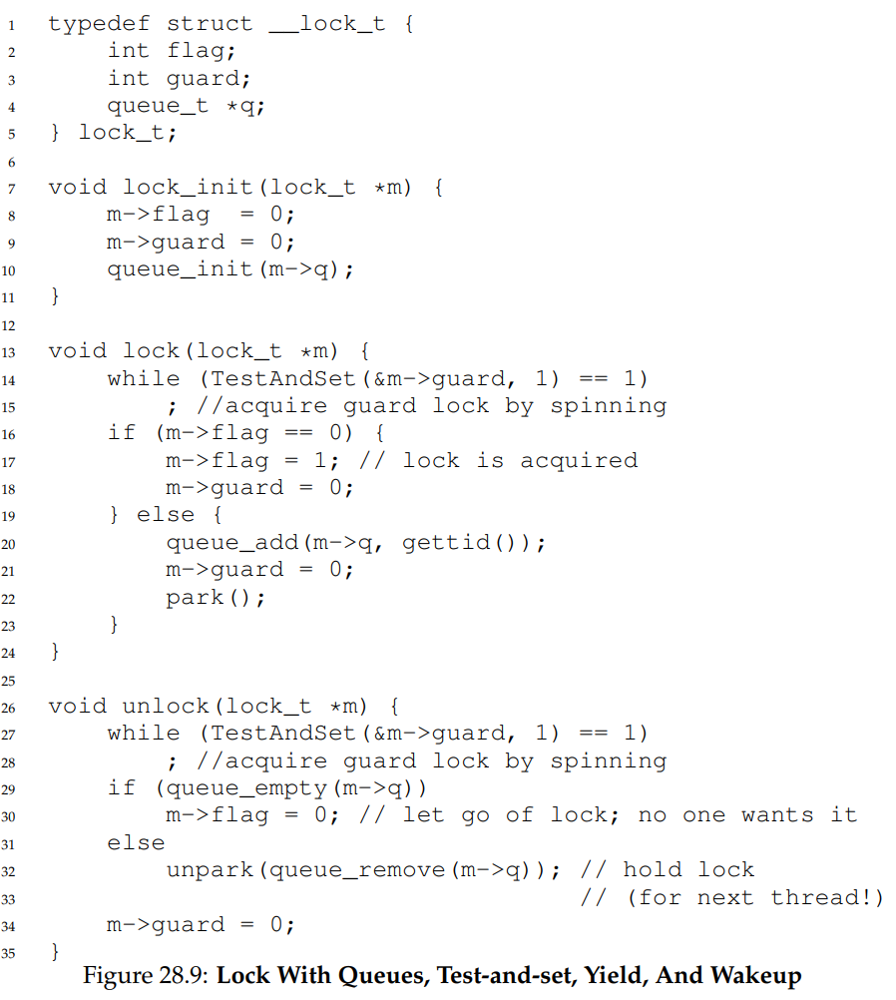

## Why is the flag not set to 0 when another thread gets woken up? 

This is because when a thread gets unparked, the conditions resumes from when it gets parked - i.e.  lock held. Note that it does not hold the guard at that point and thus cannot set the flag to 1. 

## What is the wakeup waiting race? 

When a thread is about to park, since guard is released prior to parking, an interrupt could occur and another thread could be scheduled. If the scheduled thread is the thread holder the flag, it could complete the critical section. Then when the context switches back to the parking thread, it will sleep forever. 

## How is wake up waiting race prevented?

- Run in kernel space 
- Have a special primitive (setpark). If unpark is called before park is completed, the park primitive would return immediately without sleeping. 

## What is an object monitor

A lock is automatically acquired and released everytime an object is used 

## What is perfect scaling 

We want the code to run on multiple processors as quickly as a single thread does on one - i.e. can be done in parallel so no waiting time is needed 

## How does approximate counter work 

- Local sums for each thread, each having a a local lock 
- If local sum exceeds a threshold, local sum value is added to global sum and then reset to 0 (is a critical section).

## What is condition variables

An explicit queue that threads register themselves to when some conditions are not met. When the condition has changed, the threads can be woken up and continue to do work. 

## What are conditional variables primitives 

wait and signal

## What are the parameters to wait 

Input - cond var and a lock - assume lock is already acquired

Put thread in queue of cond var and release lock 

## What is the issue with the following conditional variale code - no state variable 

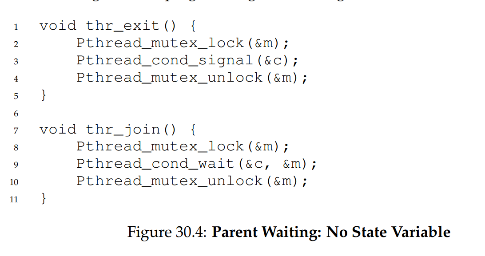

If the child thread runs first (triggering `thr_exit`), the parent will not wake up. 

## What is the issue with the following conditional variale code - no lock

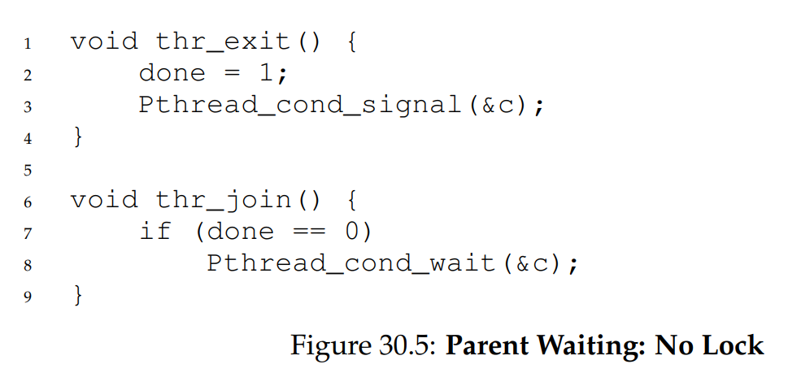

There could be interleaved operations as follows:

- Parent - if done == 0
- Child - done == 1
- Child - signal 
- Parent wait 

Then the parent thread never wakes up 

## Do we need conditional variable in implementing a conditional variable?

Yes

## Do we need to hold lock when calling conditional variable (signal and wait)

Yes 

## How to correctly implement producer consumer problem

- Use while loop
- Separate conditional variable for the producer and consumer 

## Describe the issue w.r.t the following implementation when there are multiple consumers

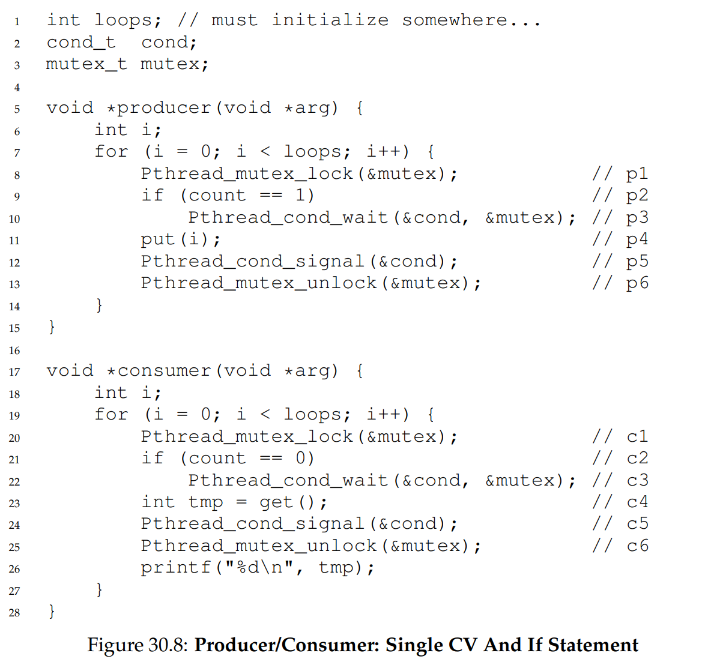

Does not have the while loop. If there are C1, C2 and P. C1 sleeps. P produces item -> causing C1 to wake up. If C2 gets scheduled before C1, C2 takes item from the queue, leaving C1 with nothing. Fixed with a while loop.

## Describe the issue w.r.t the following implementation when there are multiple consumers

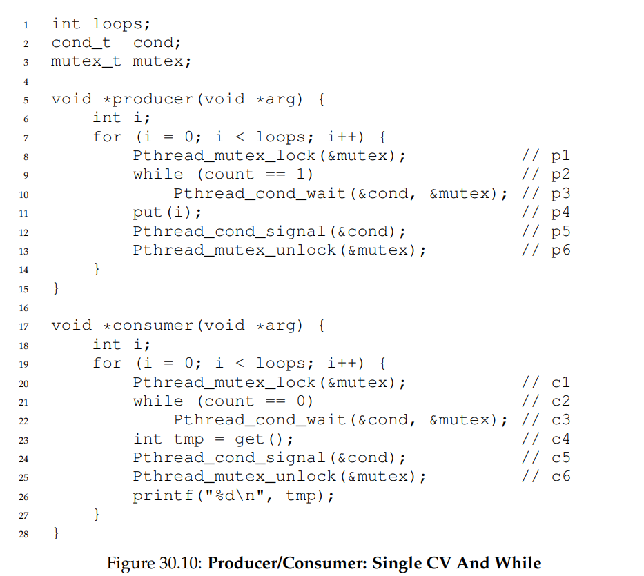

Shared conditional variable for both producer and consumer. 

- C1 sleeps
- P1 put item
- P1 sleeps
- C2 get item

The problem now is C2 may wake C1 up which is wrong. Solved with separate cv for producer and consumer 

## What is Mesa semantic 

When a thread gets waken up, it maynot get scheduled immediately, thus the conditions when it wakes up and when it gets scheduled might be different 

## What is Hoare semantic

When a thread gets waken up, it gets scheduled immediately 

## What is a covering condition

Essentially a broadcast, wakes up everyone. This solves the problem when you don't know who to wake up 

## How to initialise a semaphore 

Initialise with a value 

## Describe the behaviour of sem_wait 

Decrement value of semaphore by 1 and wait if semaphore is negative 

## Describe the behaviour of sem_post 

Increment the value by 1 wake on sleeping thread if there is one 

## If a semaphore value is negative, what value does it represent 

The number of threads waiting 

## How to use semaphore as a lock 

- Init semaphore value to 1 
- Sem wait 
- Critical 
- Sem post 

## How does using semaphore as a lock work

init sempahore to 1. Hence only 1 thread can enter the critical section, regardless of how the threads are scheduled.

##  How to use semaphore like a conditional variable?

- Initialise semaphore value to 0 
- Parent to call sem wait 
- Childrent o call sem post 

## How does using semaphore as a conditional variable work?

- If parent is scheduled first, it is put to sleep. The child then runs and wakes up the parent 
- If child is scheduled first, it increment semaphore value to 1. Parent then does not need to wait as this is the correct sequence. 

## What problem is represented in the dinning philosopher problem 

Deadlock 

## How to break deadlock dinning philosopher 

Break dependency cycle

## Given the following structure, where does incorrectness occur?

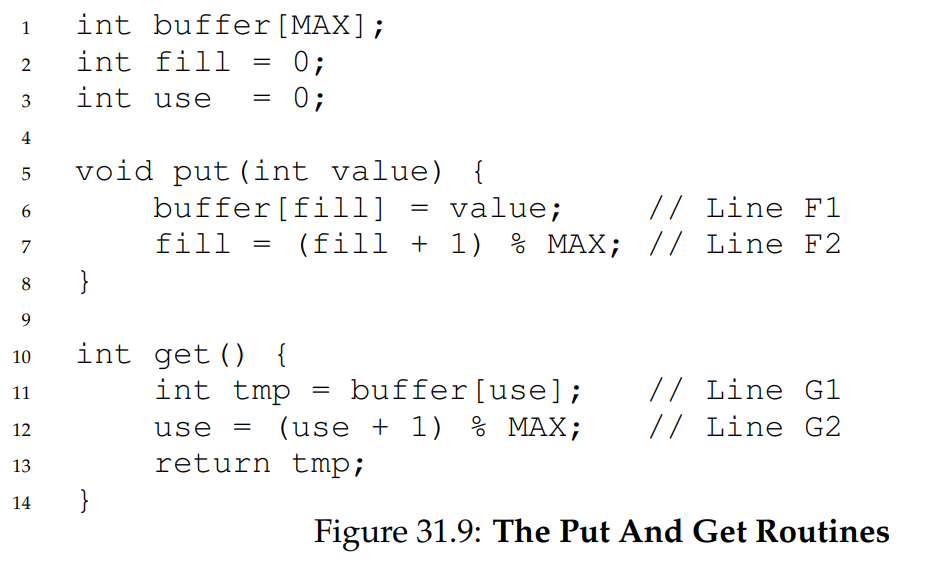

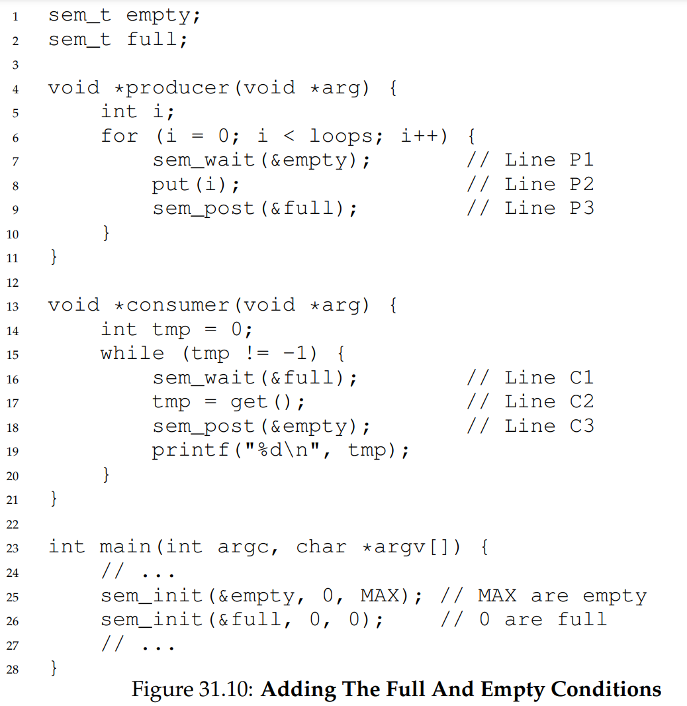

The problem here lies when there are multiple producer and MAX is more than 1, which could allow current call to put. Since put is a critical section, without locking, it could lead to race condition. E.g P0 puts value at fill = 0. Before fill is updated, P1 puts value at fill = 0 and updates fill to 1. Hence missing value 

## What is the issue with the following implementation and how to fix it

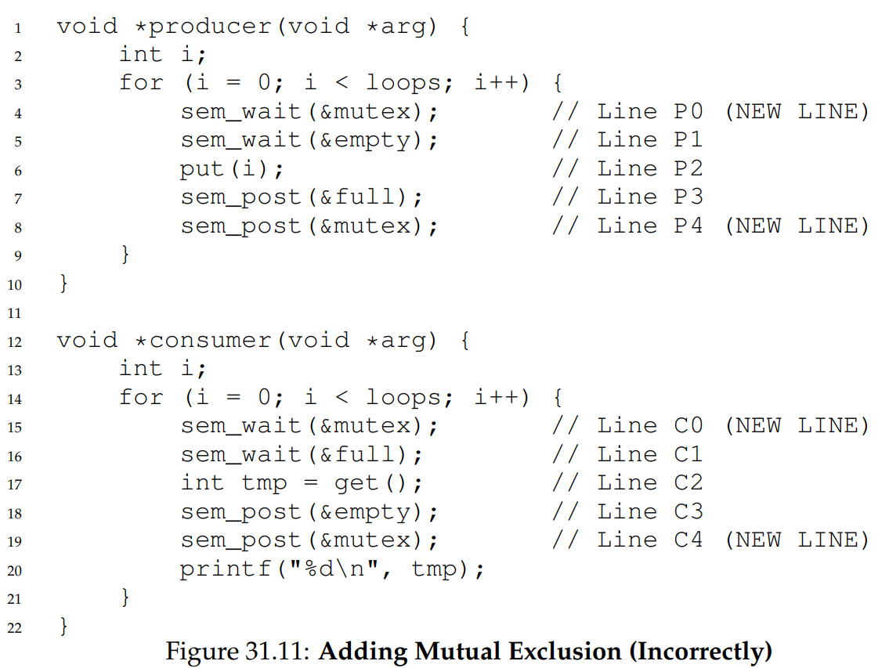

Leads to deadlock. For instance, consumer runs first, hold mutex then go to sleep at sem wait. Producers then also sleeps because mutex is now 0. To fix this, just change the order of the lock 

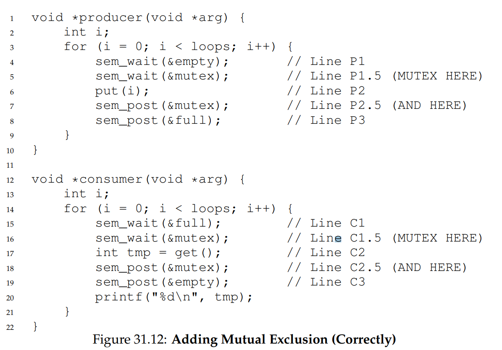

## Are wait and post atomic 

Yes 

## Are wait and signal atomic 

Yes

## How to implement semaphore wait with lock and conditional 

- acquire lock 
- while loop if count <= 0 then cond to wait 
- set count -= 1
- release lock 

## How to implement semaphore post with lock and conditional 

- acquire lock 
- set count ++ 
- cond signal 
- release lock 

## What is atomicity violation 

Desired serializsability among multiple memory accesses is violated (intended to be atomic but not executed well)

## Describe the issue with the following implementation and how to fix it

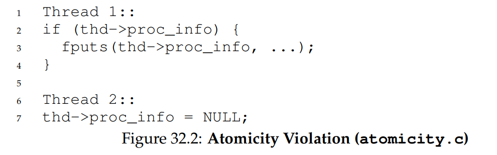

Thread 2 may modify proc info to null before fputs 

To fix, place a lock 

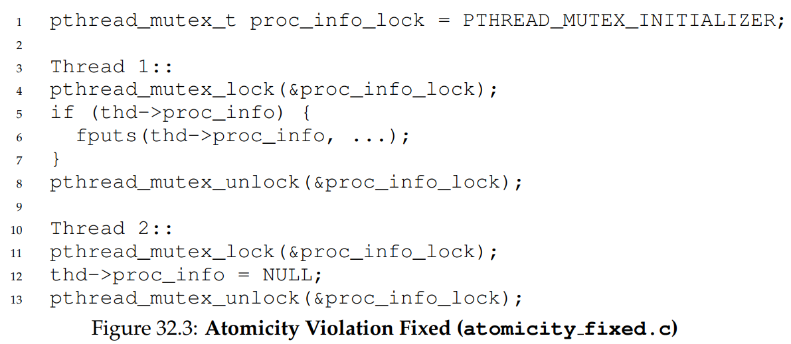

## What is Order violation bug 

Program is designed to be run in a specific sequence but not enforced 

## What is the issue with the following code and suggest a fix 

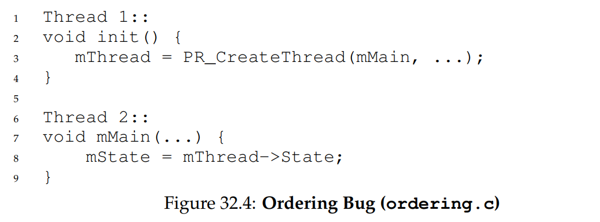

Correct sequence is thread 1 create then thread 2 extract state. Issue is thread 2 might be called before thread 1. To fix, use conditional variable

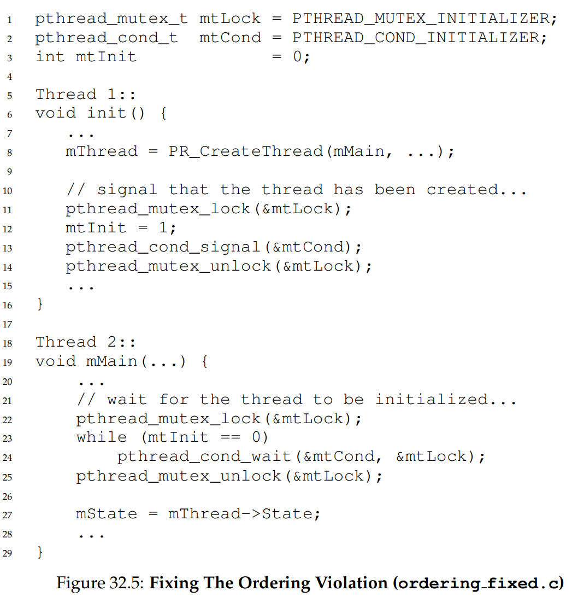

## Draw a deadlock dependency graph for the following code 

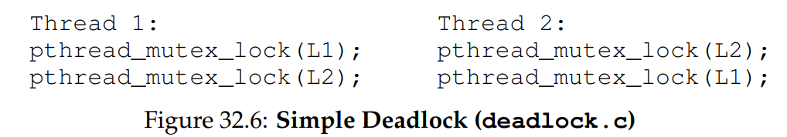

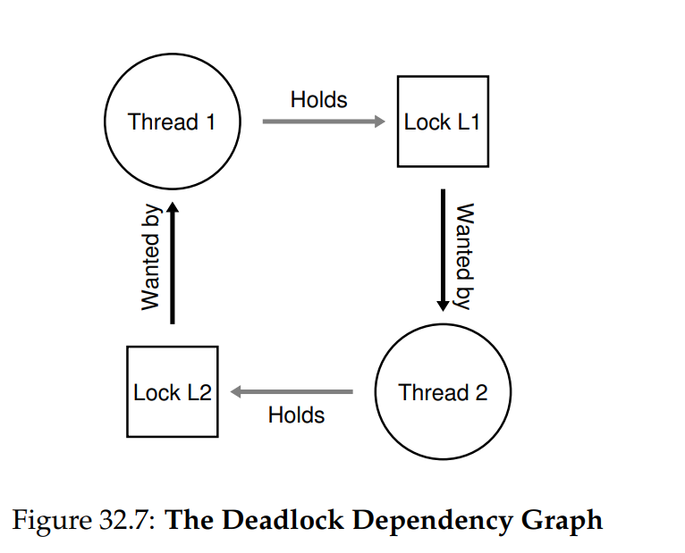

## Why do deadlocks occur

- Complex dependencies between components 
- Encapsulation hides implementation details from user

## What are the conditions for deadlock 

- Mutual exclusion - thread claims exclusive control over resources
- Hold and wait - thread holds resources allocated to them 
- No preemption - resources cannot be forcibly removed from threads holding them 
- Circular wait - chain of threads each holds one or more resources requested by another thread 

## Do the four conditions need to be met for deadlock to occur?

Yes 

## How to prevent circular wait

Enforce ordering on lock acquisition 

## How does total ordering work 

If there are only two locks, make sure that L1 is always acquired before L2 

## How does partial ordering work 

Enforce ordering among certain groups of locks 

## What is the issue with enforcing lock ordering 

Require intricate knowledge of the code base 

## How to prevent hold and wait 

Acquire all locks at once, atomically 

- Have a global lock to acquire other locks 
- Acquire all locks sequentially 
- Release global lock 

## Why is acquiring all locks at once atomically problematic 

Encapsulation as this requires knowing what lock to be held 

Decrease concurrency 

## How to prevent no preemption 

Use an interface call `trylock`. The sequence is like this 

- T1 acquires L1
- T1 tries to acquire L2
- If successful go to critical section 
- Otherwise release L1

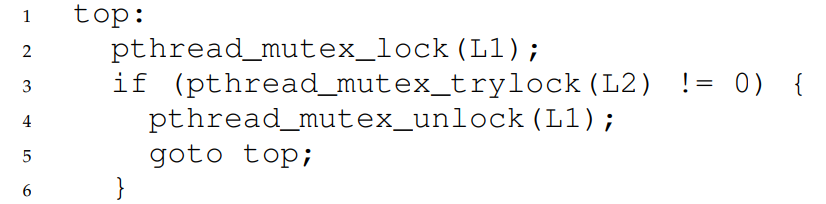

## What could potentially be the issue with try lock 

Live lock as T1 and T2 try to acquire and release locks repeatedly

## What is a solution to trylock live lock

Have random timeout 

## How to prevent mutual exclusion 

Use lock free and wait free data structure with hardware assisted primitives 

## Show how using compare and swap can be used to replace locking in the following scenario

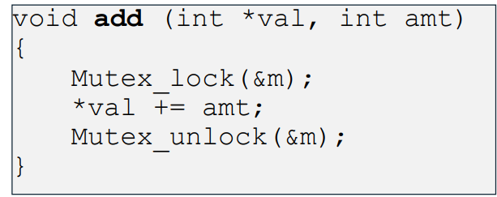

Use `CompareAndSwap(val, old, old+amount)` where old is the old value 

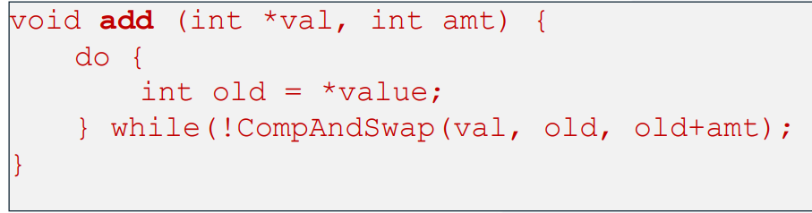

## Show how using compare and swap can be used to replace locking in the following scenario

Use `CompareAndSwap(head, n->next, n)`

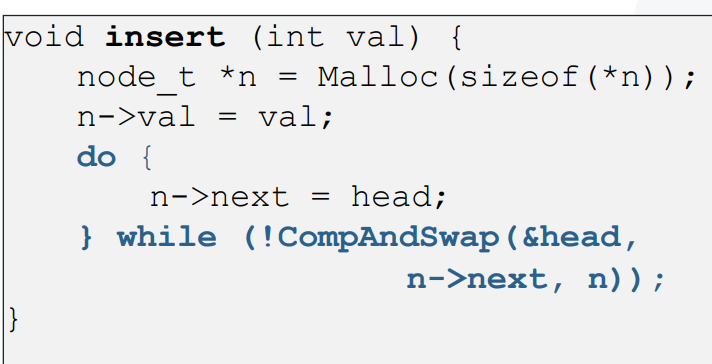

## Describe how the banker algorithm work?

- Resources - m element array describe the total number of resources for each type in the system 
- Allocated - n x m. Allocated[i][j]=k means Thread i has been allocated k instances of j 
- Maximum - n x m. Maximum[i][j] = k means Thread i requires up to k  instances of resource j 
- Needed - n x m. Needed[i][j] = k means Thread i needs k more instances of j to finish the job 

- Need a deadlock detection - assume there is a sequence of threads T1, T2, ... such that each requesting resources then releasing resources to the pool such that all requests are satisfied 

If a request arrives 

- Check if available resources can satisfy the request 
    - If not deny 
- If possible, assume the request is granted 
    - Check if the system reaches deadlock - i.e. if can be released 

## Banker algorithm how to check if a state is safe 

- Loop through all threads indefinitely
    - If the available resource can satisfy a thread maximum request, release, add all allocated resources from that thread to available 

If there exists a sequence of release such that all thread maximum requests are satisfied, the current state is safe. 

## Answer this 

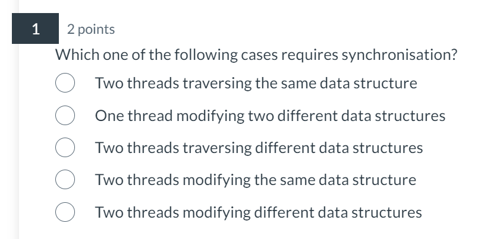

Two threads modifying the same data structure

## Answer this 

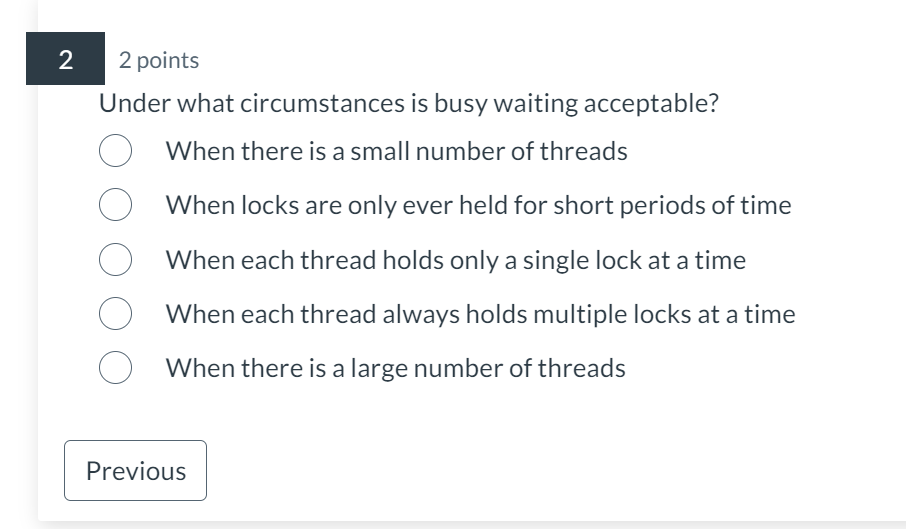

When locks are only ever held for short periods of time 

## Answer this 

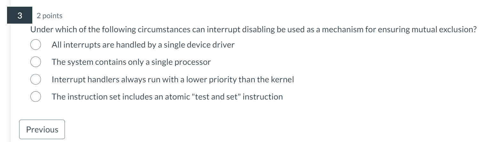

The system contains only a single processor

## Answer this 

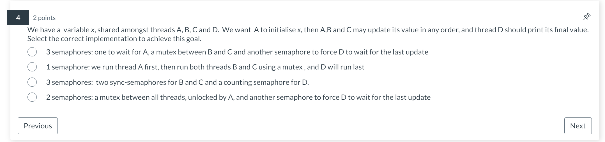

2 semaphores: a mutex between all threads, unlocked by A, and another semaphore to force D to wait for the last update

## Answer this 

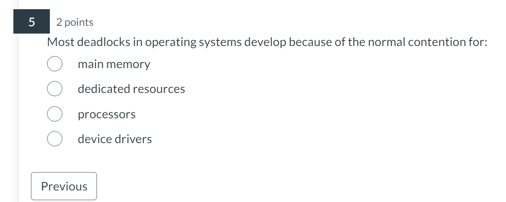

dedicated resources 

## Answer this 

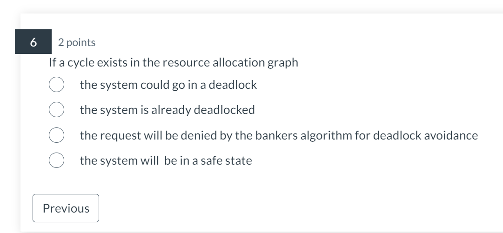

the system could go in a deadlock

## Answer this 

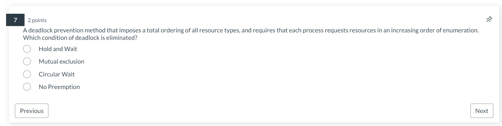

Circular Wait 

## Answer this 

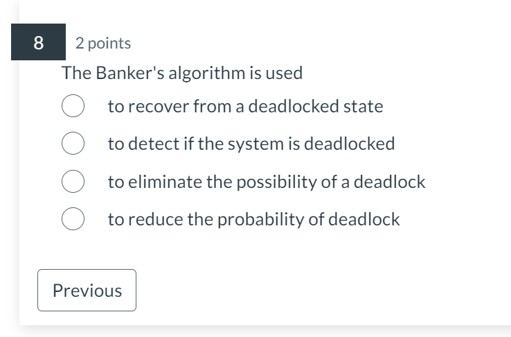

to eliminate the possibility of a deadlock

## Answer this 

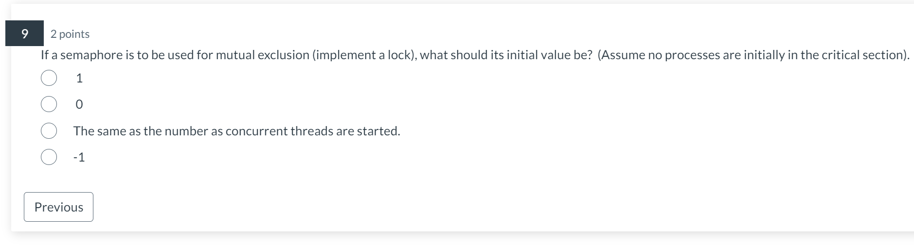

1

## Answer this 

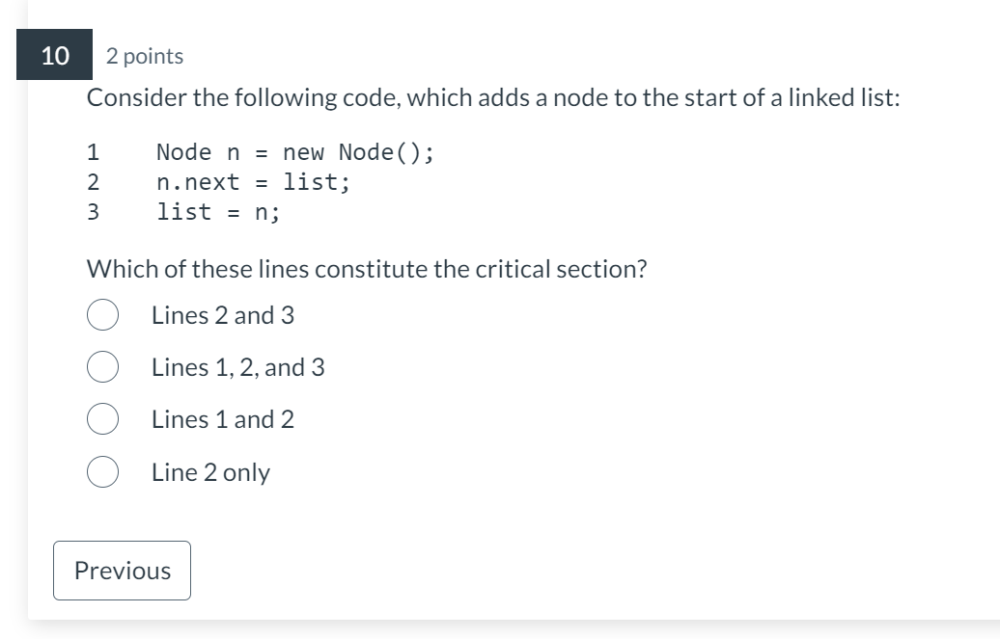

Lines 2 and 3 