## Why is there a need for hierarchical IO structure? 

- Costs and performance
- Faster bus needs to be short (no room to plug devices)
- Components that demand high performance are nearer to the CPU
- Lower performance components are put in peripheral bus.

## What are the components of a canonical device 

- Hardware interface which allows the software to control its operations. (Status, Command, Data)
- Internal structure - implementation of the hardware interface. 

## Describe the four steps canonical protocol 

- Polling: the OS checks whether the device status is ready 
- Programmed IO: the OS sends data to data register
- The OS writes command to command register to be executed
- Poll for exit status 

## What is Programmed IO 

When the OS is directly involved with data movement 

## What is the problem with four step canonical protocol

A lot of polling which is wasteful. No work is done during the polling period 

## How does interrupt improve the canonical protocol?

- Instead of repeatedly poll the device, the OS issue the request, put the calling process to sleep and context switch to another task. 
- When the device operation is complete, it will raise a hardware interrupt.
- OS then executes an interrupt handler, finishing the request and waking up the sleeping process 
- Thus both the CPU and the disk are utilised during this process

## What could be the problem with interrupt in canonical protocol?

- If the poll period is quick, interrupting can be expensive due to context switch 
- Potential livelock in networks, when there are a huge stream of incoming packets, each generate an interrupt. The OS thus spend its time processing interrupt and never run any user-level process.

## How to address livelock network interrupt?

- Use polling 
- Coalescing - wait a bit and gather all the interrupts to be processed at once. This however, increases latency 

## What is the issue with Programmed IO when transferring a large chunk of data to a device?

The CPU is burden with trivial task and waste clock cycles

## What is DAMA and how is DAMA superior to Programmed IO 

- A DAMA is a special device that allows data to transfer between devices and main memory without much CPU intervention

- CPU does not need to waste CPU cycles, instead only needs to instruct DAMA which data to transfer and where to send to 

## What are the two different methods of Device Interraction 

- Explicit IO instructions - instructions that allow OS to send data to specific device registers (privillege instruction)

- Memory mapped IO. The hardware make device registers available as if they are memory locations. 

## What is memory mapped IO?

The hardware makes device registers appear as if they are memory locations. To access register, OS writes data to the memory locations.

## Can IO instructions be executed in user mode? 

No in privillege mode. Other processes could use a loophole to control the machine 

## What is a device driver?

A driver provides a software interface to hardware devices, enabling the OS to access hardware functions without needing to know about the implementation details. 

## What are the downsides of device driver encapsulations?

Some features that do not fit into the abstraction interface will not get used. 

## Descibe the address space of a drive

A drive consists of N blocks (512 bytes) array. Address space is from 0 to N - 1

## Is multi-sector/multi-block operations supported for a drive?

Yes. Read can be done in parallel. Write is usually on one block with atomic operation. 

## Describe the geometry of a disk

## Can there be multiple platters on a disk?

Yes

## What is a disk cylinder 

Aggregate of the same track number on every platter used for recording 

## What is rotational delay

If the head is on the right track, the head will need to wait for the platter to rotate to the right sector. The waiting time is rotational delay. 

## What is seek time

If the head does not reside on the right track, it needs to move to the right track. This moving time is seek time. 

## What is transfer time

Time required to perform IO once the head resides on the right track at the right sector 

## What is track skew 

The rearrangement of sectors on a disk so that by the time the computer has read and processed one sector, the next will be in the right position for the disk to read (cross track read). 

## Why is track skew useful

The arrangement is useful because without the rearrangement, once the disk head has read from one track and moved to the other track with the desired sectors, it will need to wait for rotation, incurring rotational delay. 

## What is a multi-zoned disk 

The surface is divided into a number of concentric zones. Within a zone, the number of bits per track is constant. Each zone has the same number of sectors per track. Outter zones have more sectors than inner zone. 

## What is a track buffer 

Cache for storing data read from or to disk. 

## Formula for finding IO time 

`Tio = Tseek + Trotation + Ttransfer`

## Formula for finding rate of IO 

`Rio = FileSize/Tio`

## Assume the following Disk Drive Specs, find rate of IO for a random read of 4KB and sequential read of 100MB

- Tseek: 4ms
- Trotation: 1/(15000/60)/2 = 2 ms (average is half of rotation time)

For random read: transfer time = 4KB/125MB = 31 micro seconds 

Hence Tio for random read: 6ms. 
Rio for random read: 4KB/6ms = 0.65 MB/s

For sequential read, time take is seek time + a rotation + transfer:

4ms + 2ms + 100MB/125MB/s = 0.806s

Hence Rate of IO: 100MB/0.806 = 124.1 MB/s (close to max transfer rate)

## Why is there a need for disk scheduling? 

Because IO cost is high, the OS plays a role in deciding the order of IO issed to disk. i.e given a set of IO requests, the OS decides which one to schedule next. 

## What is the difference between process scheduling and disk scheduling 

IO scheduling is more predictable by estimating the seek and rotational delay -> Generally shortest job first 

## Describe the principle of shortest seek time first 

Order the IO requests based on nearest track to complete. 

## What are the issues with Shortest Seek Time First

- Disk geometry information not available to the OS - the OS only sees an array of blocks
- Lead to starvation - if there is a steady stream of requests for the current track, IO requests for other tracks will be ignored. 

## Describe the mechanism of the Elevator scheduling

The arm moves in and out to the edges of the disk. Requests that are currently on the direction of movements are handled. 

## Describe the elevator variant FSCAN 
The queue to be service is freezed during movement. Requests that come during a sweep are placed in a queue. This avoids starvation of far-away requests

## Describe the elevator varient CSCAN

Sweep is only in one direction, from outter to inner, and then reset at outter.

## Why is CSCAN fairer than FSCAN 

CSCAN is fairer to the sectors at outter tracks. In SCAN, middle tracks can be served twice.

## What is the issue with SCAN-family algorithms?

Doesn't take into account rotation. 

## Describe Shortest Positioning Time First

Schedule IO request that takes the shortest time to move the head to, taking into account rotation. 

## Why is it difficult to implement Shortest Positioning Time First

Need to know both the track geometry and the rotational speed. Thus SPTF is usually implemented inside a drive 

## Where is disk scheduling performed in modern OS system

In both the OS and the disk. The OS picks the best few requests and sends them to be handled by the disk 

## What is IO merging in the context of disk scheduling 

Wait for IO request to aggregate before handling them. This reduces the number of requests sent to the disk and hence lower overheads. 

## What is the difference between work-conserving and non-work-conserving scheduling approach

Work-conserving - immediate handle request as it arrives
Non-work-conserving - wait for some time before handling requests. 

## What are the motivations for using RAID?

- Faster IO operations 
- More capacity 
- More reliable 
- Transparent

## Why do people say RAID is transparent

RAID is transparent to the user (user + OS). Externally RAID is viewed as just a faster, bigger and more reliable. Users can just plug RAID in inplace of an HDD without having the change anything else.

## What is a mirrored RAID system?

A RAID system that keeps two copies of each block (on separate disks).

## What happen when an IO request is made to RAID?

RAID calculates which disk or disks to access to complete the request, then issue one or more physical IOs to do so. The exact requests depend on the RAID level. 

## What is the fail-stop fault model?

A disk is in exactly one of two states - working or failed. If it is working - IO can be performed. If it fails, it's gone.

## Can failures be detected in fail-stop model?

Yes

## How to evaluate a RAID capacity? What is the upper bound on capacity, what is the capacity in mirrored system?

Given N disks each with B blocks, how much capacity is available? Upperbound is NB. With mirroring NB/2

## How to evaluate RAID reliability 

How much disk faults can a design tolerate - wrt fail-stop fault model 

## How to evaluate RAID performance 

Depends on workload 

## Describe RAID 0 design 

Feature of RAID 0 is striping 

## What is a stripe in RAID 0

Blocks on the same row 

## What is a chunk size for RAID 0 

Size of a block to put on one disk before striping to the next disk

## How does a small chunk size affect performance.

- Small chunk size -> a file is striped across multiple disk -> increase parallelism.

- However positioning time for the request increases -> Determined by the maximum of positioning times of the request across all drives. 

## How does a large chunk size affect performance 

- Large chunk size -> a file is on one disk -> decrease parallelism 

- However positioning time is localised to that of one disk

## What is the capacity of RAID 0
NB 

## What is the reliability of RAID 0 

No reliability feature offered. 

## What is the performance of RAID 0 for serial workload 

Equivalent to full bandwidth of the system N*S

## What is the performance of RAID 0 for random workload 

Equivalent to full bandwidth N * R

## What is RAID1 design 

A data is mirrored across some blocks. The number of copies is the degree of mirroring

## Describe what happen when an IO request is made to RAID1

If READ request -> choose one of the two mirror. If WRITE -> write to both mirrors. 

## What is RAID1 capacity

NB/2 since half of the blocks are reserved for mirrors

## What is RAID1 reliability

Tolerate failure of any one disk, and up to N/2, if the disks are non-mirrors. 

## What is RAID1 latency for a single read request

The same as on single disk.

## What is RAID1 latency for a single write request

Two writes made in parallle, but need to wait for both to complete. Hence slightly longer than a write on a single disk. 

## What is RAID1 steady state throughput for sequential workload 

When writing to disk sequentially, each logical write results in two physical writes, hence maximum bandwidth for RAID 1 is (N * S)/2

When reading to disk, the bandwidth is also (N * S)/2. Each disk receives a request for every other block. Hence while it is rotating over the skipped blocks, it does not do any useful work.

## What is RAID1 steady state throughput for random workload?

Random read -> full possible bandwidth as the read can be distributed across all disks. N*R/2

Random write -> N*R/2. Will need to perform two physical writes for each logical write.

## Describe RAID 4 design 

RAID4 has a parity bit design that is placed on a dedicated disk 

The parity design allows error detection and correction for a single disk failure 

## What is RAID4 capacity

Since 1 block is dedicated for parity bit, the capacity is (N-1)B

## What is RAID4 reliability

Tolerate exactly 1 failure 

## What is RAID4 steady state throughput for sequential workload 

Read - utilise all of the disks except for parity, hence (N-1)S

Write - full stripe write: calculate the new parity value then perform a write in parallel, hence (N-1)S. Even though the parity disk is utilised, there is no performance gain, hence effective performance is on N-1 blocks. 

## What is RAID4 steady state throughput for random workload 

Read - (N-1)R

Write (subtractive parity): for each write request, will need to perform 2 read and 2 write physical IOs. Since parity disk is the bottle neck, performance is R/2

## What are the two modes for RAID4 random write workload? 
Write there are two modes:
- additive parity: read all blocks in a stripe inm parallel, then XOR and write in parallel. Problem: scales with number of disks. More disks-> more read.
- subtract parity: read old data and read the old parity. If the new write data is the same, the parity bit will also be the same. If the new write data is different, the parity bit is also different. 

## What is RAID4 IO latency 

Single read - the same as for a single disk 

Single write - twice that of a single disk (2 reads + 2 writes)

## What is the small write issue

For each physical write to random workload, RAID4 needs to perform 2 reads and two writes, where one read and one write is performed by one parity disk. Hence performance is limited by the parity disk and cannot be scaled up even if more disks are added. 

## What is RAID5 design

The same as RAID4, except the parity block for each stripe is rotated across the disks to remove the small-write bottle neck issue

## What is RAID5 performance 

Same as RAID4, except for random write. For random write, no bottle neck, but there are still 4 operations to be done for one request, hence NR/4. For random read, all disks contribute to performance, so NR instead of (N-1)R

## Summarise capacity of RAID systems:

## How to improver RAID0 throughput and latency

Latency -> better individual disks 

Throughput -> add more disks 

## What is a file

Linear array of bytes each of which can be read or write 

## What is a directory 

It contains a list of (user-readable name, low-level name) pairs. 

## What is an absolute pathname? 

Name from root 

## How to create a file 

Use open with O_CREAT parameter

## What does open return 

A file descriptor 

## What is a file descriptor in UNIX?

Is an integer, private per process used to access file. A pointer to a file type that can be passed to methods to access the file. 

## How does UNIX manage file descriptors?

Since file descriptor is private per process, there is an array to file descriptors in the `proc` structure.  

## What are the three types of file names

Path, file descriptor and inode 

## What are the standard file descriptors in a process 

0 - stdin, 1 - stdout, 2 - stderr 

## What is an inode 

Each file has one inode number that is unique within file system. Different file systems may use the same number and numbers may be recycled after deletes. 

## API to perform sequential read and write in UNIX

open, read, write 

## API for perform random read 

lseek system call 

## What does lseek do 

Change a file offset 

## What does fork do 
When using fork, entries in the open file table is shared. When multiple processes share a file descriptor, the reference count is the number of processes that share the descriptor. All processes must close the file descriptor for the entry to be removed. 

## What does a file struct contain

- inode - which file is it referencing 
- refcount - reference count 
- offset - current offset value 
- read - whether can be read from
- write - whether can be written to

## What is an open file table 

A file structure representing all currently open files in the system. With one lock per entry. 

## What does dup do 

Allows a proces to create a new file descriptor that refers to the same underlying open file as an existing descriptor.

## What does fsync do

Flush the buffer hence immediately write to disk 

## What does write do w.r.t buffering

When write system call is issued, data is put in a buffer, which will be written to disk after a brief period. 

## Explain how data can be lost with `write`

Write buffers write data and flush after some brief period. If the system crashes before the data is written to disk, it will be lost. 

## What does it mean for rename to be atomic:

If system crashes during renaming, either the new name or the old new is used, nothing in between.

## What is a file metadata 

Information about each file, including its size, inode, ownership information, etc 

## How to remove a file 

Use unlink to remove association between a human readable name and inode. It also checks if ref count is 0. If it is -> remove and free the inode

## What does an empty dir contain 

Itself and its parent - i.e. . and .. 

## How to open, read and close dirs?

opendir, readdir, closedir 

## What are the requirements to delete a dir using rmdir 

Needs to be empty i.e contains no file other than . and .. 

## What does link() do?

Create another name in the directory you are creating the link to and refer it to the same inode number 

## What happen when you create a file 

- Make a structure (inode) that track all relevant information about a file 

- Linking a human readable name to the file

## What is the restriction with hardlink 

Hardlink cannot be created for a directory (cycle in directory tree)

Hardlink cannot link files in other disk partitions (inode numbers are only unique within a particular file system, not across file systems).

## Is symbolic link of regular file type?

No it is symbolic link type i.e with ls appears as l in stead of -. With stat, appears as symbolic link instead of regular file.

## What kind of data does symbolic link hold?

Holds the pathname of the linked file

## What is dangling reference with symbolic link

The original file is deleted, leaving the symbolic link pointing to nothing 

## Unix permission identities:

Owner - owner of the file, Group - anyone in a group, Other - anyone 

## How to assemble a directory tree from many underlying file systems?

- Make the file systems 
- Mount them 

## What does mount do 

Take an existing directory as a target mount point and past new file system onto the tree at that point. 

## Describe the on-disk organisation of the data  structure of vsfs file system 

- Data region - blocks containing data 
- Metadata region - inode blocks
- Bitmaps - one for data region, one for inode table 
- Superblock - contains information about the file system - i.e how many inodes and data blocks are in the file system, where the inode table begins, etc. 

## What do data bitmap and inode bitmap contain?

Array of 0 and 1 indicating whether the data or inode is free (0) or used(1). 

## Given the following vsfs structure as follows, determine the address and block number of inode 32.

address = 12KB + 32*256= 20KB

block number = 20KB/512= 40 where 512 is sector size 

## What are contained inside inode struct?

- type: regular file, dir 
- size: how large it is 
- number of blocks allocated to it
- protection information 
- mode - can be R/W/E
- uid: who owns this file
- gid: group this file belongs to 
- links_count: how many hard links 
- block pointer 

## What are the different ways inodea refers to where data blocks are?

- Direct pointer - each pointer refers to the block containing the file. Problem if file is larger than one block 

- Indirect pointer - pointer to a block of pointers, each of which points to the blocks containing the file. 

## If an inode have 12 direct pointers and a single indirect pointer, blocksize = 4KB and 4 bytes disk addresses, how large can the file grows to be?

4KB of pointers, each of size 4 bytes, hence 1024 pointers in indirect block + 12 direct pointers. Hence total number of pointers = (12+1024).

Each pointer points to a separate block, hence total file size = (12 + 1024) * block_size = (12 + 1024) * 4KB

## Why is an imbalanced tree used? 

Most files are small, hence the imbalanced design reflects the reality

## How is a directory organised in vsfs system? 

- inode number 
- file name 
- string length (size of filename)
- record length (total bytes for the name plus left over space)

## Why is there a need for record length for on disk data for directory?

When a file is deleted, its spot is marked empty using inode of 0. Hence record length is used to indicate free space. 

## How is a directory stored on disk 

Metadata contained in an inode stored in inode block

Actual data contained in a data block 

## How does vsfs identify free space 

With two bitmaps

## Describe a process for creating a file from bitmap allocation perspective:

- Look through the inode bitmap, search for a free inode
- File system mark the inode as used
- Update on disk inode bitmap with the correct information 
- Look through data bitmap to find free nodes
- Update edata bitmap

## How does ext2 and ext3 allocate data blocks on Linux?

Look for a sequence of blocks that are free then allocate them to the newly created file. 

Portion of the file is guaranteed to be contiguous hence improve performance. 

## What happen to the superblock when the filesystem is mounted?

The super block is in memory 

## Describe the process for opening and reading file bar in /foo/bar

For open 
- read root inode to find where root data 
- read root data to find foo inode 
- read foo inode to find foo data
- read foo data to  find bar inode 

For read 
- read bar inode to find bar data 
- read bar data 
- write to bar inode - last accessed

## Describe the process for creating and write file bar in /foo/bar

For creating new file:

- read root inode for root data 
- read root data for foo inode 
- read foo inode for foo data 
- read inode bitmap to find spare inode 
- write back update to used 
- write update foo data that it contains bar inode data 
- read bar inode 
- write bar inode 
- write foo inode 
- write foo inode update its size 

For writing to bar 

- Read bar inode 
- Read data bitmap 
- Write data bitmap 
- Read write bar data 
- write bar inode - last updated 

## How to reduce read IO

Cache popular block  

## How to reduce write traffic 

Use write buffering 

## How does write buffering work? 

- Delay write - batch some updates into a smaller set of IO 
- OS can schedule file IO 
- Some writes may be avoided alltogether by delaying them 

## Describe the trade off with write buffering 

- Reduce traffic 
- Increase write latency 

## What are the issues with old file system 

- Performance starts off bad then turns to worse
- Treat a disk like a RAM - expensive positioning costs
- Data blocks far from its inode -> expensive seek when read inode then write data 
- Files are fragmented as the free space was not carefully managed.
- Logically contiguous file would be accessed by going back and forth across the disk, hence reducing performance. 
- Internal size was too small - bad for transfer as each block might have a positining overhead 

## What are cylinder groups 

- Cylinder connect the same track on each platter ( same distance from the centre). 

## How does cylinder group help improve performance?

Placing logically connected file on the same group. Accessing one after the other will not need long seeks. 

## Describe the component of a single cylinder group 

Similar to vsfs - Super block, inode bitmap, data bitmap, inode, data blocks.

## How does FFS allocate directory 

- Find cynlinder group with low number of allocated directories (balance number of directories between groups) and high number of free inodes (allocate a lot of files)

## How does FFS allocate files

- Allocate data blocks of a file in the same group as its inode to prevent long seek 
- Place all files in the same directory in the same cynlinder group of the directory they are in. 

## Why is the first FFS distribution better than the second 

For the first, files having the same parent dirs are on the same group as its parent. Hence directory walk is more efficient as it reduces seek time.

## Why is there a need for large file exception in FFS?

Large file could occupy and entire block, hence the inode block may contain only one file. 

## How does FFS handle large file

Stride large file across blocks in chunks

## How does FFS uses chunk size to alleviate seek cost with large file exception

Use large chunk size,hence system spends most of the time transferring data from disk and little time seeking -> Amotisation

## What is amotisation

Increase the workdone per overhead to lessen the impact of overhead 

## How does FFS determine blocksize for large file exception

- The first 12 direct blocks on the same group as inode 
- Each subsequent indirect block and its block data on different group.
- Every 1024 blocks of the file in separate groups, except for the first group with direct pointers. 

## What is the issue with small size files in FFS

- Internal fragmentation when the file gets deallocated 
- Positioning overhead when

## What is FFS solution to small size files

- Sub blocks - 512 byte little blocks that file ssytem could allocate to files. If a small size file of 1KB, occupy to sub blocks. Hence does not waste an entire 4KB. As the file grows, the system will continue allocating 512 byte blocks until it grows to 4KB, then all the sub blocks will be copied to a 4KB block. 

- Will also use buffered writes -> issue write in 4KB chunks and avoid sub-block specialisation in most cases. 

## How does FFS optimise for sequential read - parameterisation

Interleaving section. So that in sequential read, once a read from a sector is completed, the head is placed right at the next sector, without wasting rotation delay.

Use in conjunction with a track buffer which reads an entire track. Thus subsequent read to the track will be served by the track buffer. 

## What is crash consistency problem 

We want to move the system from one consistent state to another 

However, system commits each write individually, so crashes can leave the system in inconsistent states. 

## What is data redundancy 

If A and B are two pieces of data and knowing A eliminmates some or all values B could take, there is a redundancy between A and B 

## Give example of data redundancy

Mirror disk (complete redundancy)

Parity Blocks (partial redundancy)

## If Superblock contains the total number of blocks and Inode contain pointer to data blocks, how is redundancy made 

If superblock contains N blocks, then the pointer of inode takes value between 0 and N - 1. Anything above is invalid 

## Advantages of redundancy 

- Performance (RAID1)
- Reliability (RAID5, RAID1, Superblock)

## Disadvantage of redundancy

- Capacity 
- Redundancy 

## If a filesystem is appending to a file, what must it update 
- Inode 
- Data bitmap 
- Data block 

## Describe what happen when system crashses with different update mode for file appending

- Data block - nothing wrong 
- Inode - point to garbage data, another file may overwrite 
- Data bitmap - space leak
- Data block and Data Bitmap - no pointer to data, space leak 
- Inode and Data bitmap - garbage data 
- Data block and Inode - inconsistent value of mem alloc, can be overwritten by another file

## Describe the idea behind file system checker 

Let inconsistency happens but fix at reboot. Scan the entire disk structure to discover and fix inconsistencies. 

## Issues with file system checker 

- Slow 
- Doesn't make sense to scan the whole disk when operations are performed on a small set of blocks
- Require instrinsic knowledge 
- May not work all the time - consistent but may not be correct 

## Why is journalling preferred over file system checker 
- Does not read the entire disk
- Get the correct state - atomic operation

## What is the idea behind journalling 

Use a log (journal block) to record transactions. Fight redundancy with redundancy 

### What constitute a journal transaction 

Transaction begins, inode write, bitmap write, data block write, transaction ends 

## What is a journal commit block 

Transaction end block 

## What is physical logging 

Putting the exact physical contents of the update in the journal 

## What is logical logging 

Putting a compact representation of the update in the journal 

## What is checkpointing

Once update has been written to the journal, they can be used to overwrite the data on disk.

- Issue write to inode, data bitmap and data block once they are in the journal 

## Why separate journal write and journal commit 

- Journal write can be done in parallel, followed by a journal commit 

- If journal commit is groupped together with journal write to be done in parallel, a crash could leave inconsistent state - i.e. write inode, write bitmap, write transaction begins and ends but crashes while writing data block which is not detected. 

## How does a system recover from crash with write-ahead-log 

Replay the transaction in order 

## How does journaling optimisation give the illusion of inifite log?

Circular log. Once a checkpoint is complete, the journal space must be freed - i.e. mark the oldest and newest non-checkpointed transactions in the log in a journal superblock. All other space is free. 

## How does journaling optimisation reduce disk traffic 

Coalesce individual transactions into a global transaction (buffering updates)

## What is a journaling optimisation to reduce double disk write for data block 

Metadata journaling - data block is written first. After the data block is written, the journal writes the metadata update - inode, bitmap. 

## What is a journaling optimisation for small journal size 

Use transaction header to store block number

## How to use barrier 

- Write journal updates 
- (barrier)
- Journal commit 
- Checkpoint 
- (barrier)
- Journal commit 
- Free

## How to remove barrier between journal updates and journal commit 

Make the commit block contain the checksum of the updates. If during recovery, checksum does not compute -> invalid entry 

## Sumarise the physical journaling steps 

- Write transaction updates 
- Write transaction commits 
- Checkpoint 
- Free data 

## Sumarise the metadata journaling steps 

- Write data block to disk 
- Write transaction updates 
- Write transaction commits 
- Checkpoint 
- Free data 

## What is the main idea behind Log structured file system 

- When writting to disks, LFS buffers all updates in a memory segment. Once the segment is full, flushed to an unused part of the disk. 
- Never overwrites existing data, but write write to free locations.
- Because segments are large, write performance utilises write capacity. 

## How does LFS write sequential data 

- All updates are put in a segment that will be written to disk when file is full.
- Need to write data block + inode + imap 

## How does LFS enable finding inode 

Using inode map - mapping between inode number and disk address of the most recent version of the inode. Hence will be implemented as an array. Anytime an inode is written, the imap is updated with new location.

## Where is the imap placed?

Next to where it is writing all of the other new information.

## How is the inode map located?

Using checkpoint region -> fixed location. Contains pointer to the latest pieces of the inode map. The CPR is updated periodically.

## How does LFS enable reading a file

- Read checkpoint region to find latest inode map 
- Cache inode map in memory 
- Reference the inode and file

## How does LFS store directories 

- Imap contains address to inode of dir and files
- Inode of dir contains pointer to data of dir 
- Data of dir contains mapping of file (name: inode)
- Use mapping of file to locate file inode and read file 

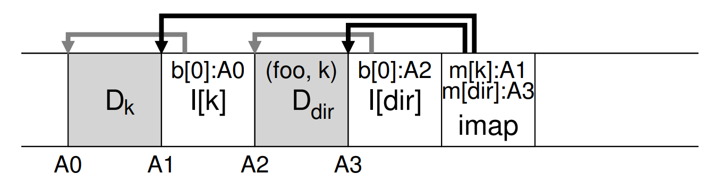

## How does LFS handle garbage collection 

The inode points to the data block of different versions - i.e. array pointing to current data block and previous data block -> versioning file system 

Periodically LFS cleaner reads in old segments and determine which blocks are live. Write new segments with just the live blocks and freeing up the new one. 

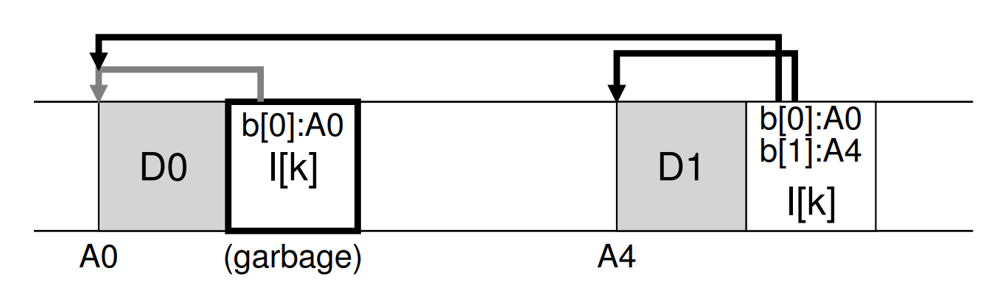

## How does LFS determine which block is live 

Use segment summary block - contains the inode and offset (which block of the file this is).

- Look in Segment summary, find inode N and offset T.
- Look imap to find inode of N and read N 
- Use the offset T to look in the inode to see whether the Tth block is on disk. If same -> live.

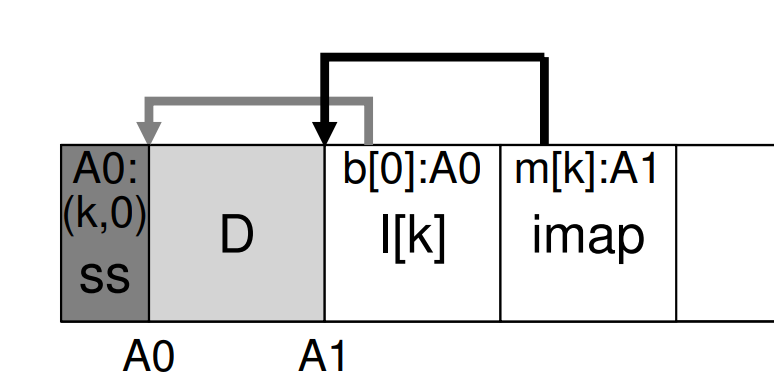

## How does LFS determine which segment to clean 

- Clean most empty 
- Clean coldest - undergoing least change

## What is recursive write issues 

For every data update, updates propage all the way to tree root

## How does LFS avoid recursive write 

The inode value for the update remains the same. The directory is therefore not updated. Only the imap structure is updated. 

## How does LFS handle logging 

Updates put to segment and when full, begins to write.

Write written to log - i.e. checkpoint region points to a head and tail segment and each segment points to the next to be written. 

LFS writes to CR every 30s, the last consistent snapshot of the file system may be quite old. Thus upon reboot, LFS recover by reading in the checkpoint region, the imap it points to and subsequent files and directory. Some updates may be lost.

Also use roll forward. Start with latest CR, find end of log (included in CR) use that to read through next segments and see if valid updates within. If there are LFS updates the file accordingly and recover.

LFS keeps two CRs, one at either end and writes to them alternately. When updating the CR with the latest pointer to inode map, it first writes a header (timestamp) then the body of CR then one last block. If crashes during CR update, LFS detects by seeing an inconsistent pair of Timestamp. Always choose to use the most recent CR with consistent timestamps. 

## Answer This 

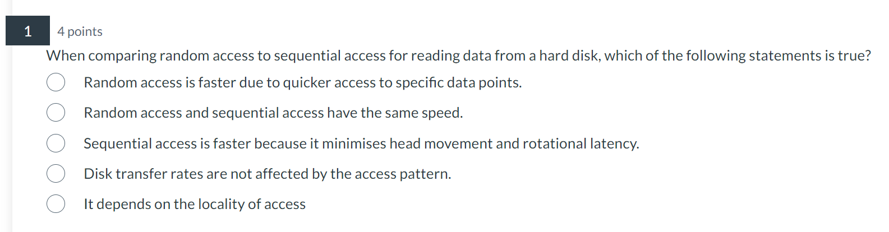

Sequential access faster because it minimises head movement and rotational latency 

## Answer This 

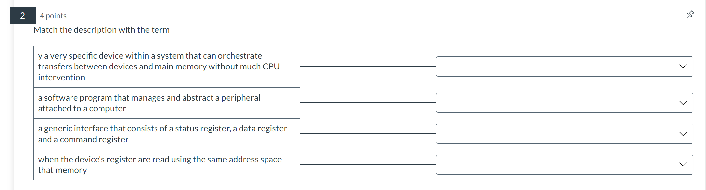

DMA engine, device driver, device controller, memory mapped IO 

## Answer This 

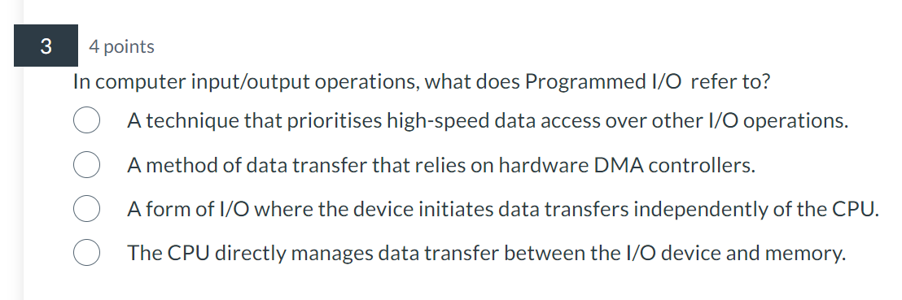

CPU directly manage data transfer

## Answer This 

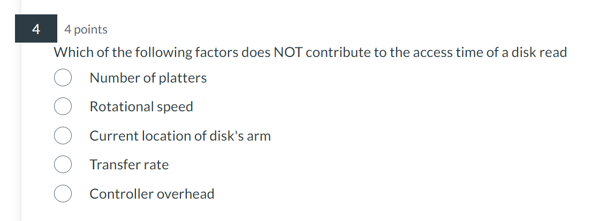

Number of platters 

## Answer This 

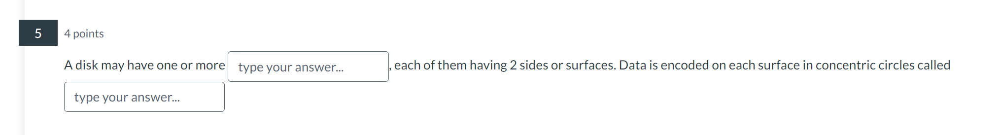

Platters, tracks 

## Answer This 

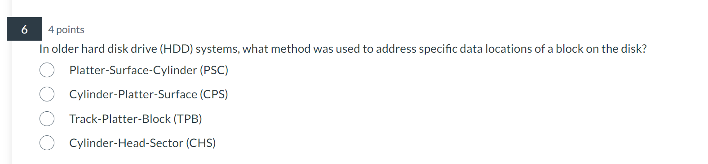

Cylinder head sector 

## Answer This 

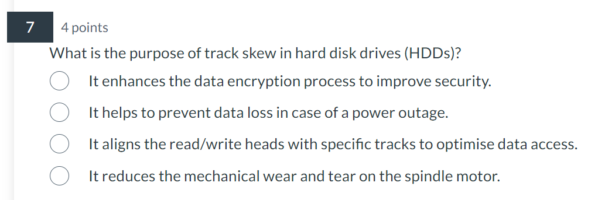

Aligns read write heads with specific tracks to optimise access 

## Answer This 

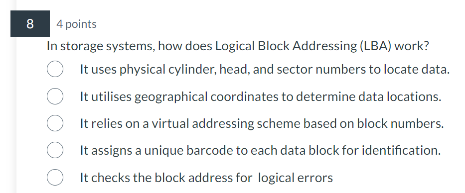

It relies on virtual addressing scheme based on block numbers 

## Answer This 

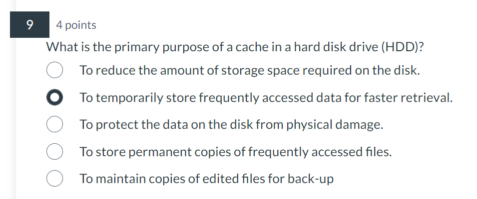

## Answer This 

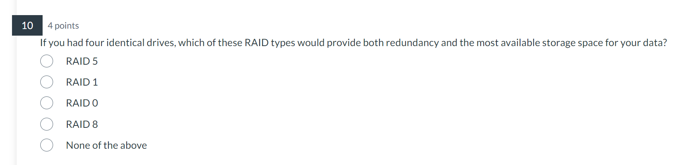

RAID5

## Answer This 

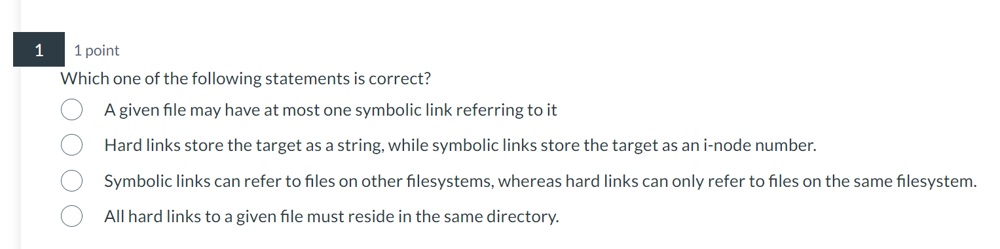

Symbolic links can refer to files on other filesystems, whereas hard links can only refer to files on the same filesystem.

## Answer This 

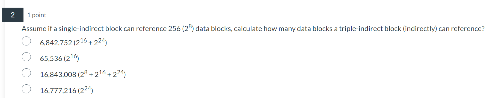

2^24

## Answer This 

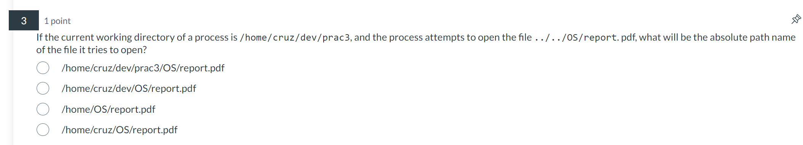

## Answer This 

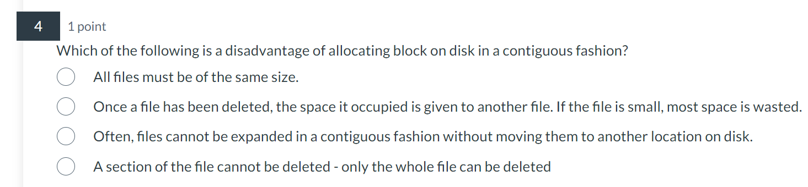

Often, files cannot be expanded in a contiguous fashion without moving them to another location on disk.

## Answer This 

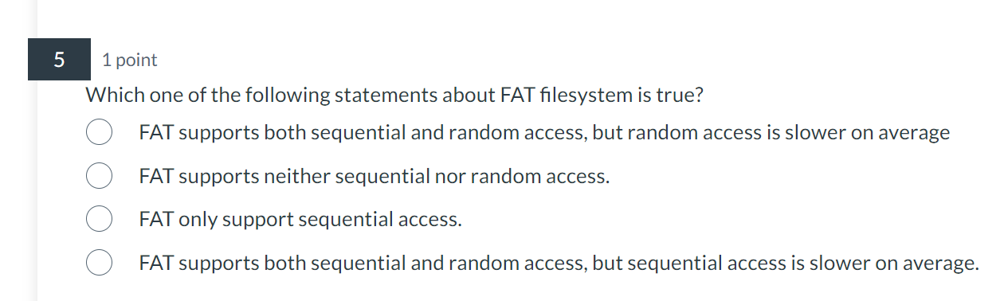

FAT supports both sequential and random access, but random access is slower on average

## Answer This 

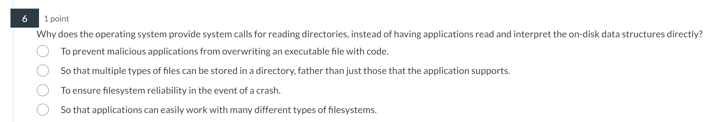

So that applications can easily work with many different types of filesystems.

## Answer This 

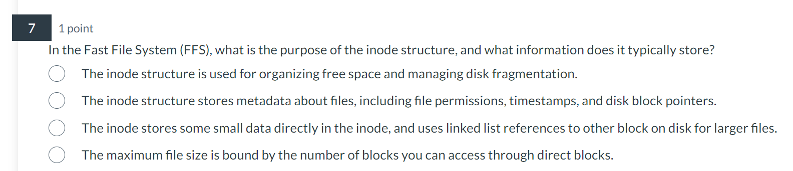

The inode structure stores metadata about files, including file permissions, timestamps, and disk block pointers.

## Answer This 

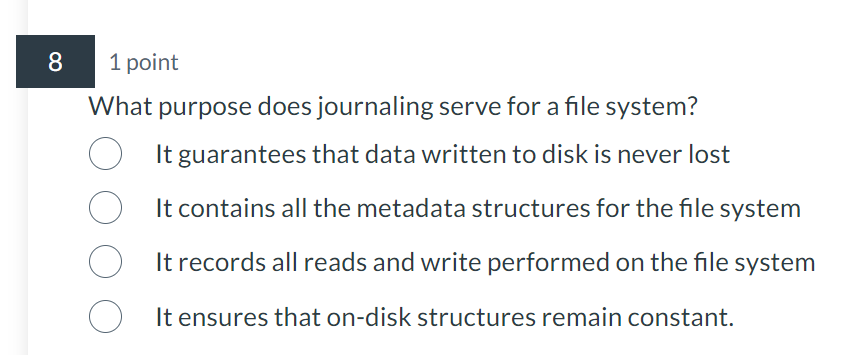

It ensures that on-disk structures remain constant. 

## Answer This 

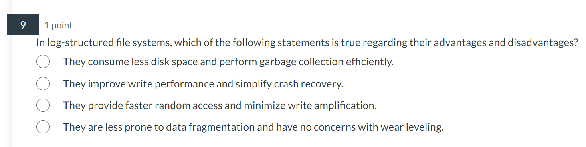

They improve write performance and simplify crash recovery.

## Answer This 

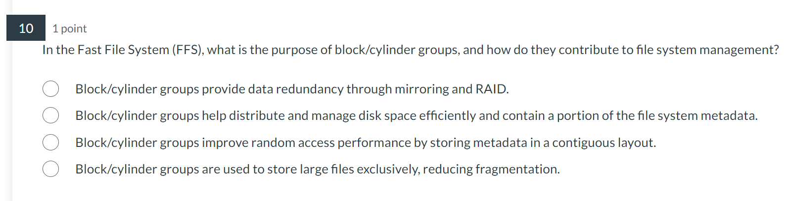

Block/cylinder groups help distribute and manage disk space efficiently and contain a portion of the file system metadata.

