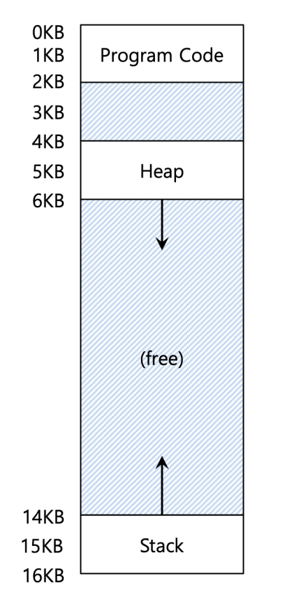
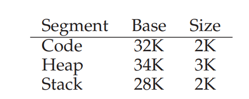
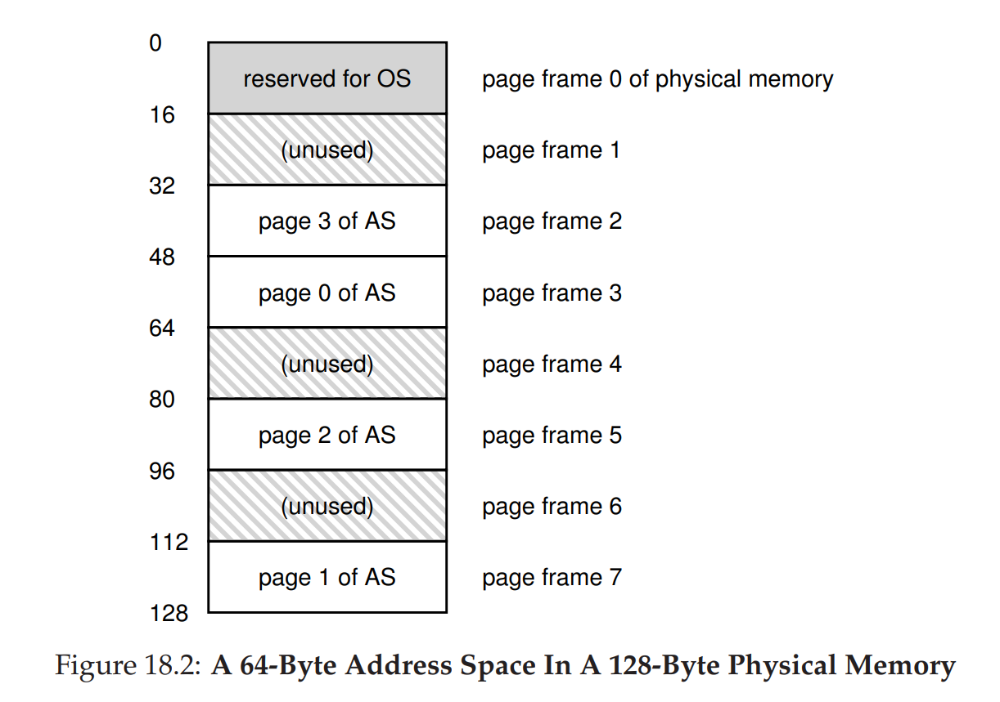
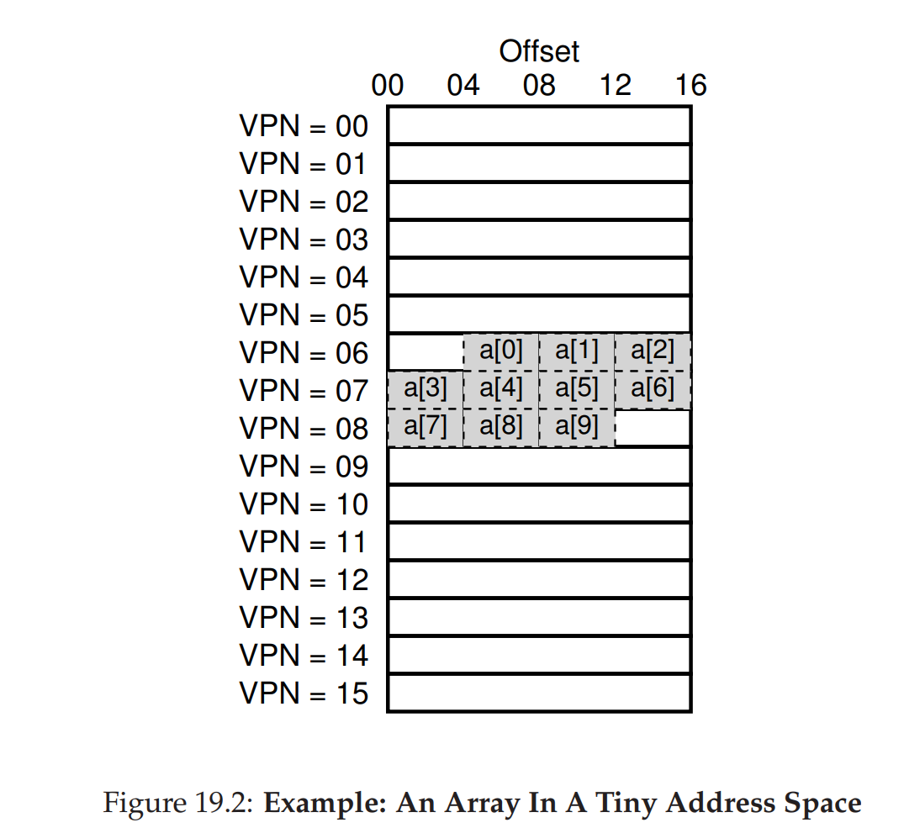
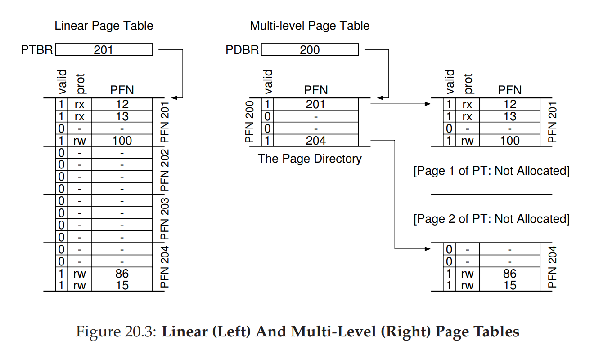

## What are the goals of virtualising memory

- Transparency 
- Efficiency 
- Protection

## What is transparency in memory virtualisation

The implementation details of virtual memory should be invisible to the running program.

## What is efficiency in memory virtualisation 

- Time: run quickly 
- Spacec - don't use too much memory 

## What is protection in memory virtualisation

- Each process can only access addresses in its address space
- Run in isolation 

## What is address translation

The hardware transforms each memory access - i.e fetch/load/store instruction, changing virtual address to a physical address where the desired data is located. 

## What is the difference between uni programming and multi-programming and why is multi-programming prefered w.r.t memory virtualisation.

For uni programming, only one process is loaded to memory, and operation is performed on the entire memory space. 

For multi-programs, multiple processes are loaded to memory and share the memory space by having different isolated address spaces. 

Benefits: higher resource utilisation, more efficient. 

## What is the motivation for dynamic memory allocation 

- Sometime we do not know the required memory size at compile time.
- If we can only allocate statically, we must allocate as much as possibly needed -> storage is not used efficiently. 

## What is stack allocation and its benefits 

Simple to allocate and deallocate -> just increment/decrement the stack pointer.
No fragmentation 

## What are the advantages and disadvantages of heap allocation 

- Heap works for all data structure 
- Slow, and usually lead to fragmentation (small chunks of free space between allocated memory blocks). 
- Need to search for free space

## How can timesharing be implemented for memory virtualisation and why is it not preferred.

- Save CPU registers to memory when a process is not running. 
- Disadvantage is poor performance. 

## What is static relocation

The OS rewrites each program before loading it as process in memory. Rewrite addresses and pointers. 

## What are the disadvantages os static relocaton

- No protection as processes can access the address of other processes.
- Cannot move address space after it has been placed

## What is dynamic relocation:
MMU dynamically changes process address at every memory reference:
- Process generate logical or virtual address in their address space
- Memory hardware uses physical or real address 

## Why is dynamic relocation prefered over static relocation?
- Protect processes from one another 

## What are the hardware support for dynamic relocation
- Kernel mode - handle traps and access physical memory. Handle memory violation exceptions 
- User mode - translate address 
- Base - fixed offset to add to address 
- Bound - either maximum size or maximum address. If access is beyond bound -> Segmentation Fault

## Can users directly change base and bound registers?

No 

## What are the advantages of Base and Bound 
- Provides protection to address space 
- Support dynamic relocation
- Simple, fast 

## Disadvantages of Base and Bound:
- Process must be allocated contiguously in physical memory 
- No partial sharing: cannot share limited parts of address space 
- Must allocate memory that may not be used by other processes 
- Hard to run when address space does not fit into the free space of physical memory 

## What are the basic principles of segmentation

The address space for each process is divided into logical segments. Each segment corresponds to logical entities like code, stack, heap. The segments can be placed independently in physical memory, and grow and shrink by themselves. Each segment can also be protected with separate R/W/E protection bits. 

## Given the following virtual memory segments and register values, provide the translated physical address when the referenced virtual memory value is 100, 4200, 15KB?

- For value 100: virtual address 100 is in the code segment, hence 
100 + 32KB = 100 + 32 * 1024 = 32868
- For value 4200: virtual address 4200 is in the heap segment, hence its off set is 4200 - 4KB = 104. Thus its physical address is: 104 + 34KB = 34920
- For value 15KB: is in the stack segment, hence its offset is 15KB - 16KB = -1KB. Its physical address is 28KB - 1KB = 27KB

## What happen if a program tries to access address out of bound: 

Segmentation Fault

## Given that the stack grows backward, how does the OS account for this during address translation?

The OS relies on a hardware bit which tells which direction the stack is growing. For instance, grows positive (T/F) tells whether increasing address values are positive. 

## How does Segmentation allows for sharing segment?

The OS uses a hardware bit (protection bit) to determine whether a segment is read-only. Read-only segment can be shared across processes. The OS only needs to put the segment in the address space of a process to share it. Bit can have values indicating read/write/execute permission. 

## What are the advantages of segmentation?

- Allows allocation of sparse address space - i.e. an address space can now be broken into segments and each segment can be placed anywhere. 
- Stack and heap can also grow independently 
- Allows for code-sharing with R/W/E protection bit. 
- Supports dynamic relocation of each segment.
- Offers protection for each segment from dynamic relocation 

## What are the disadvantages of segmentation? 

Fragmentation. Gaps that are too small that cannot fulfill any memory allocation request. 

## What is memory fragmentation?

Free memory segments that can not be usefully allocated. 

## What are the different types of fragmentation?
External - visible to allocator (OS)
Internal - visible to the requester 

## How can memory compaction address fragmentation in segmentation?
Rearrange the existing segment. Copy data to one contiguous region and change segmentation register to point to the new locations. 

## What are the disadvantages of memory compaction?

- Rewriting memory address is an expensive task that affects performance. 
- Compaction makes it more difficult for existing processes to allocate more memory 

## What is the idea behind paging?

Instead of breaking the address space into variable size segments with segmentation, the address space is split into fixed size segments called pages

## What are page frames:

Under paging paradigm, the physical address space is viewed as an array of fix-sized units called page frame. Each frame contains a virtual memory page. 

## What are the advantages of paging over segmentation?

- Flexibility - we can support the abstraction of the address space effectively, regardless of how the processes use the address space - i.e. won't make assumptions about the direction the heap and stack grow. 
- Simplicity of free space management: the OS keeps a free list of all free pages and just grab the first free pages for each memory request. - i.e. just use bitmap to show free/allocated frames.
- Simplep to swap out portions of memory to disk, since page size matches disk block size. 

## What is a page table?

Page table is a per-process data structure that is used for address translation for each of the virtual pages of the address space. 

## What is the role of a page table?

Translate virtual address of pages to their corresponding physical addresses. 

## If the address space is 64 bytes, and each page size is 16 bytes, how many bits are required for Virtual Page Number and Offset? 

64 bytes hence 6 bits are required to represent the addresses. If each page is 16 bytes, there can be 4 pages (64/16), hence two bits are required for VPN, and the remaining 4 bits are used for offset. 

## Given the follow physical address space with mapped virtual pages, when referencing a virtual address 21, what is the equivalent physical address. Assuming that the physical space is 128 bits. The virtual address space if 64 bits. The page size is 16 bits.

- With 64 bits address space, 6 bits are required to represent an address. With 16 bits per page, there are 4 pages per address space, so 2 bits are required for VPN, 4 bits for offsets.
- 21 = 16 + 5 = 010101. VPN is 01 (corresponding to virtual page 1), and offset is 0101 = 5.
- From Figure 18.2, page frame 7 contains page 1 of address space. Thus the page frame number (PFN) is 7 = 111.
- Thus the physical address: 1110101 or 117 

## What are the VPN and offset if the address space is 32 bit with 4KB pages?

4KB = 2^12. Hence total number of pages is 2^32/2^12 = 2^20 pages. Hence VPN can be represented with 20 bits and offset with 12 bits.

## Assuming 4 bytes per page table entry is needed to hold physical translation, how much memory is needed for an address space of 32 bit with 4KB page size?

Need 2^20 pages, 4 bytes per page hence the total size is 2^20 * 4 = 4MB.

## Are page tables kept on MMU? 

No, since page table is too large, they are stored in memory 

## What are in the page table

- Valid bit - whether the translation is valid - i.e. whether this page can be used or not. Accessing pages with valid bit to false may lead to seg fault. 
- Protection bits - whether a page can be read/write/execute to. 
- Present - whether the page is in memory or on disk
- Dirty bit - whether the page has been modified. Modified pages require writing back to disk. 
- Reference bit/Accessed bit - whether the page has been access recently. Useful for scheduling and page replacement. 

## Why is valid bit useful for Paging?

Valid bit indicates whether a page can be used. Unused pages are marked as invalid. There is no need to allocate physical frames for unused pages hence more efficient. 

## Describe the page table translation process for a given address:

- Extract VPN and Offset 
- Get Page Table Entry address 
- Read PTE 
- Concatenate PTE and Offset to form Physical Address
- Check whether the Physical Address is out of bound (throws exception if it is)
- Read memory at Physical Address 

## How many memory references are required for paging?

Two - read page table entry and read physical address 

## What is the issue with Page Table Translation process

- Inefficient memory referencing 
- Large table size - need to allocate entry for every virtual page, even if they are not used. 

## What is a Translation Look Aside Buffer?

It is a hardware cache.

## What does a TLB contain?

Cache of popular virtual to physical address translation - i.e. address translation cache 

## How does address translation for virtual page table address with TLB

- Get VPN and offset from virtual address 
- Perform a lookup for VPN from TLB. 
- If exists and the page is valid, get physical address and fetch 
- Otherwise perform the previous VPN check
    - Get PTE from memory
    - Check if page is valid 
    - Get physical address and fetch 
    - Put translation of VPN and PTE to TLB

## Calculate Hit rate for sequential access of the following array: 

Miss at a[0], a[3], a[7]. Hence hit rate 70%

## What is spatial and temporal locality

- Spatial - if a program access an address, it is likely to access addresses nearby 
- Temporal - if a program access an address, it may access the address again in the future. 

## What principles do caching rely on 

Temporal and Spatial locality 

## How to improve performance of TLB when given a fixed number of TLB entries

- Increase page size -> Fewer unique translation
- Increase TLB size. 

## What type of access do TLB favour - random or sequential 

Sequential 

## What access pattern will be slow with TLB?

Random 

## What is contained in a TLB 

VPN | PTE | other bits 

- valid bit 
- protection bit 
- address space identifier 
- dirty bit 

## Describe TLB Issues with Context Switches 

Since a page table is process specific, during context switch, the previous translation may still reside in the TLB, and can cause incorrect memory referencing.

## What are the two approaches in dealing with Context Switching for TLB 
- Flush the TLB - expensive because previous entries are removed
- Use address space identifier - determine which translation belongs to which process. 

## Can two processes share a page with Paging? 

Yes. This is similar to sharing a page with segmentation 

## Who handles TLB misses?
Depending on systems 
Hardware - CPU must know where page tables are, walk the page table, find entry and extract translation and update TLB
OS - CPU traps the OS to handle TLB misses 

## How does having bigger pages reduce memory size of page tables
Bigger page size -> smaller number of pages -> fewer PTE -> smaller page table 

## What is the disadvantage of having a large page size?

Internal fragmentation -> A lot of the memory is not used -> wastage

## What is an inverted page table and describe its mechanism

- Use one page table for all processes. 
- Page table entry contains entry for physical pages and information on what process is using each physical entry 
- This memory addresing is done by looking up this page table 
- Use hashing for efficiency 

## How does combining paging and segementation work?

- Instead of one page table for the entire address space, 
- Use multiple page table for each logical segment
- Each page table has associated base and bound register 
- Base points to the physical address of the page table of the corresponding segment 
- Bound to indicate limit 

## Disadvantage of combined segmentation and paging 

- Not as flexible as it assumes the structure of code, stack and heap 
- External fragmentation since page size is arbitrary, thus finding free space is complicated. 

## What is the idea behind multi-level page table:

- Chop up the page table into page size units 
- If a page is full of invalid page table entries, it is not allocated.
- To track whether a page of a page table is valid, use page directory. 

## What are contained in page directory:

Page directory entries, consisting of a valid bit and a page frame number, which corresponds to a page of PTE. 

## What are the advantasges of multi-level page table:

- Only a smaller portion of a linear page table is allocated if there are many invalid entries.
- If designed well, page directory table may fit within a page, making it easier to manage memory. i.e. the OS can grab the next free page when it needs to grow a page table -> doesn't need to be contiguous. 

## What is the disadvantage of multi-level page table:

- Another layer of memory referencing in case of a TLB miss - for the page directory and the PTE. 
- Complexity - managing the page table lookup on a TLB miss is more complex 

## Describe the trade off in time space in multi-level page table:

Additonal step for memory addressing -> for page directory followed by PTE 

Hence smaller table but takes more time for look up on a TLB miss. 

## Assume an address space of 14 bits, with 64 byte pages. How many entries would a linear page table require?

2^14/2^6 = 2^8 = 256 entries.

Hence 2^8 entries are required. 

## Assume address space of 14 bits with 64 byte pages. If each PTE is 4bytes, 

Each PTE is 4 bytes, one page is 64 bytes, hence one page can hold 64/4=16 PTEs. Since there are 256 entries, there can be 256/64 = 16 page frames.

Hence 4 bits of VPN are used for identifying page frame number (page directory index), and the remaining 4 bits are used for identifying PTE in an address addressed by PFN. 

Note that if there are 16 page frames each of size 4 bytes, the total size is 64 bytes which is one page -> well design 

## Assume a 30 bit virtual address space, 512 byte page and 4 byte PTE, can we fit a page directory table in 1 page?

30 but address space with 512 byte or 2^9 byte pages, the requred VPN is 30 - 9 = 21 bit and 9 bit offset.

Given each PTE is 4 bytes, a page can fit 512/4 = 2^9/2^2 = 2^7 PTEs.
Thus the 7 LSB of VPN are used for page table index, which means 2^14 page directory entries. Since each entry is 4 bytes in size, the total size of the page directory is 4 * 2^14 = 2^16. Hence the number of pages required is 2^16/2^9 = 2^7 = 128 pages 

