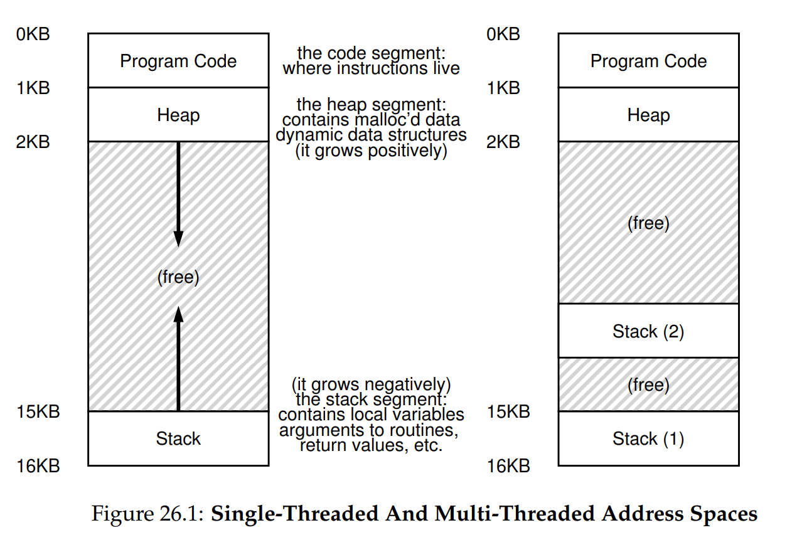

## Thread 

Is an abstraction for a single running process. Threads from the same process share the address space and can access the same data. 

Note that:

- Each thread has a program counter to track instruction state.
- Each thread has a separate set of registers.
- Context switch between threads is simply switching between the register states.
- There is no need to switching address space. 
- Each thread has a private stack. 

## Benefits of using threads:

- Parallelism - utilising multi-core processor to do parallel work.
- Avoid IO blocking - while a thread is waiting for IO, another thread can do productive work, hence not wasting CPU cycle. 

## Some issues:

- Race condition: the result depends on the timing of execution of the code. 
- Deterministic: the output is the same across different run for the same inputs.
- Non deterministic: the output is not the same across different runs. 
- Crtical section: section that access shared variables and must not be concurrently executed by more than one thread. 
- Mutual exclusion: if one thread is running the critical section, the other will be prevented from doing so. 
- Atomic operation: a sequence of operations that is to be treated as a single operation. If it fails at any point, the state before executing the operation is revert. There can be no interleaved operation. 