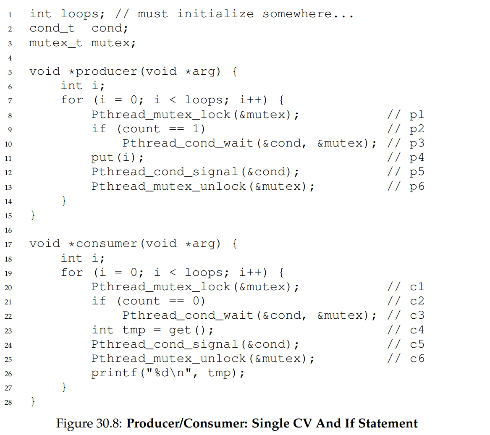
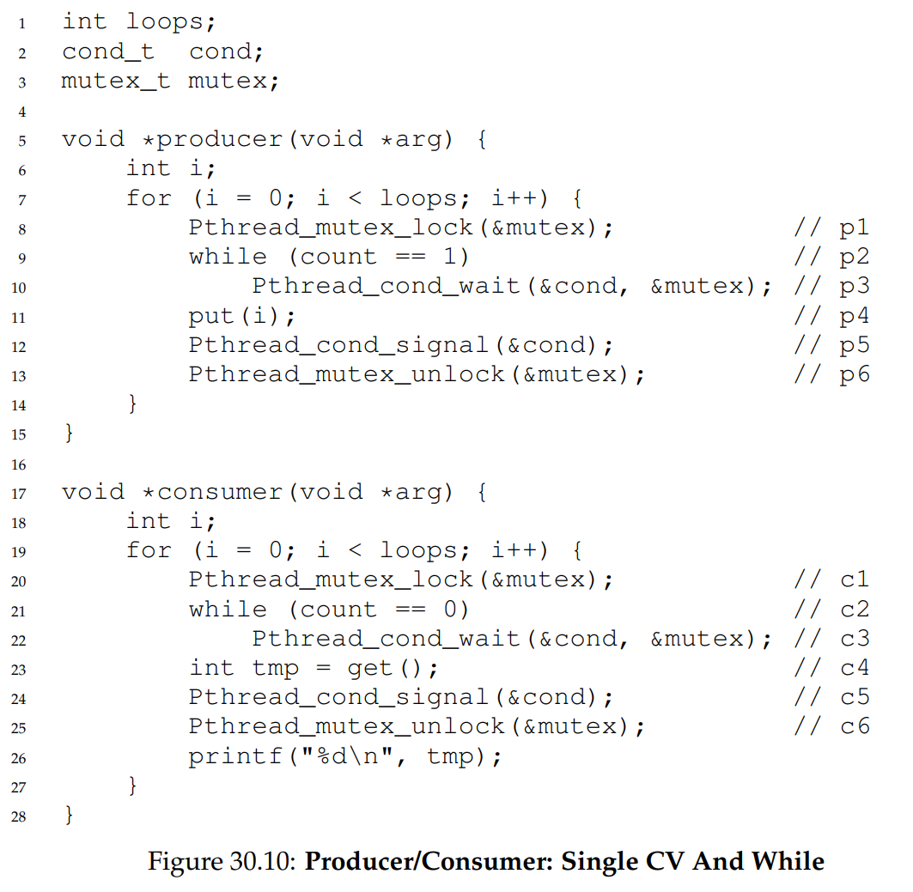
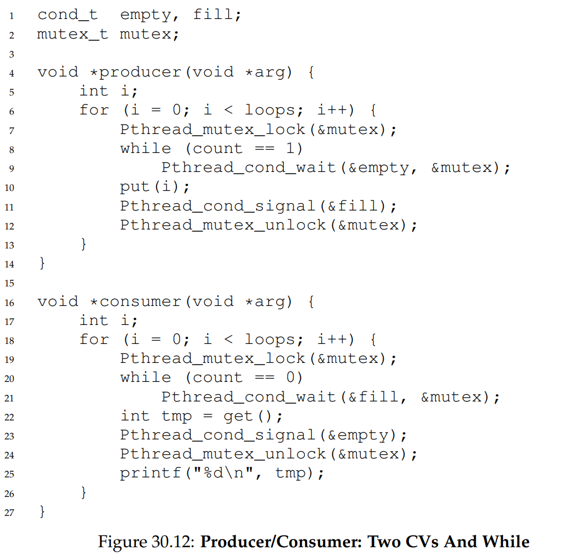
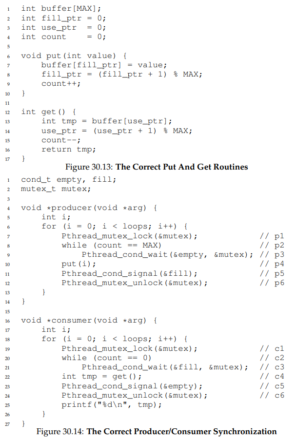
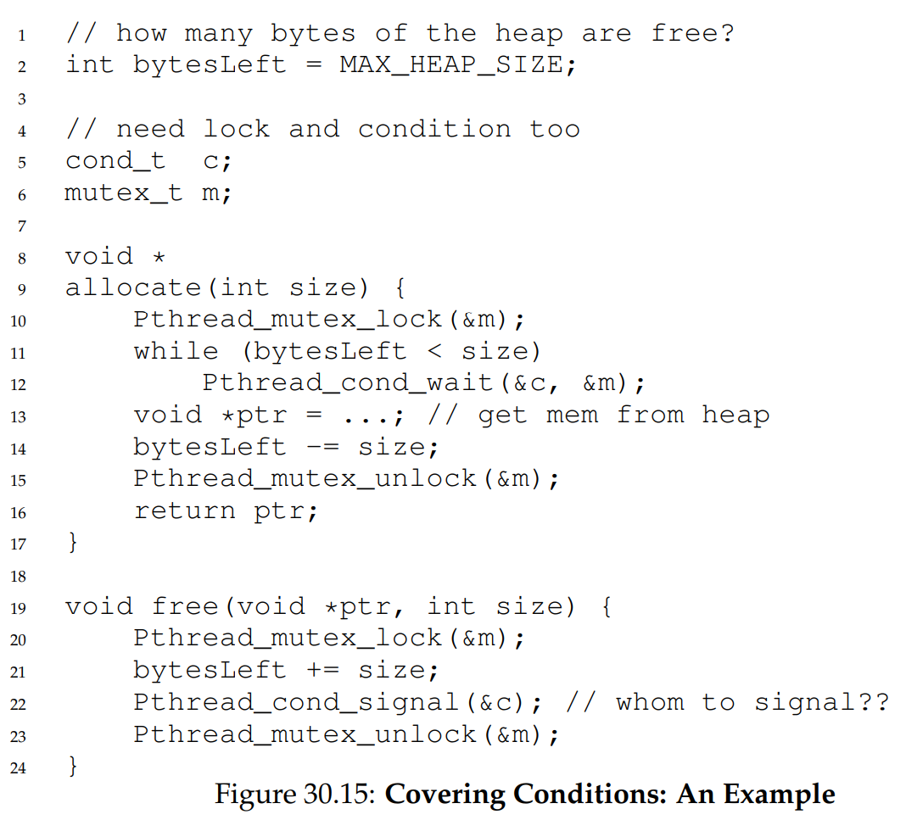

## Conditional Variable

Basically the `wait` and `notify` methods in Java. 

## Definition

Is an explicit queue that threads can put themselves on when some conditions on the state of execution are not met. When the conditions are met, the threads are woken up. 

- `wait()`: when a thread wishes to put itself to sleep.
- `signal()`: when a condition has changed and sleeping thread will be woken up.

`wait()` will assume the lock is held when calling, release the lock before sleeping, then acquire the lock when waking up. 

Take away: always hold the lock when signaling, even though it may not be required. On the other hand, it is a must to hold the lock when calling wait. Also to also use while for checking condition instead of if. 

### A working version:

The code for using conditional variable is as follows:

```C
int done = 0;
pthread_mutex_t m = PTHREAD_MUTEX_INITIALIZER;
pthread_cond_t c = PTHREAD_COND_INITIALIZER;

void thr_exit() {
    Pthread_mutex_lock(&m);
    done = 1;
    pthread_cond_signal(&c);
    pthread_mutex_unlock(&m);
}

void *child(void *arg) {
    printf("child\n");
    thr_exit();
    return NULL;
}

void thr_join() {
    pthread_mutex_lock(&m);
    while (done == 0)
        // Wait requires a conditional variable c and mutex lock m 
        pthread_cond_wait(&c, &m);
    // Unlock does not require a mutex
    pthread_mutex_unlock(&m);
}

int main(int argc, char *argv[]) {
    printf("parent: begin\n");
    pthread_t p;
    pthread_create(&p, NULL, child, NULL);
    thr_join();
    printf("parent: end\n");
    return 0;
}
```

Note that

- `wait()` takes a mutex lock as input. The purpose is to release the lock before going to sleep, and then to acquire the lock when waking up. This has the same logic as `guard` unlock before `park` in the previous chapter. This operation is done atomically to prevent race condition.
- There can be two scenarios here:
    - Parent call creates, then performs `thr_join` which release the lock and go to sleep. The child thread is then created, set done to one, and call `signal` to wake up the parent thread. 
    - The child thread is created immediately, which set done to 1 before parent enter `thr_join`. When parent does perform `thr_join`, it does not do anything since `done = 1`.
- The `while` loop is not important here, but is important later on, if the parent is interrupted from its sleep before done is finished. 

### Failed implementation: no done variable 

```C 
// No done variable 

void thr_exit(){
    pthread_mutex_lock(&m);
    pthread_cond_signal(&c);
    pthread_mutex_unlock(&m);
}

void thr_join(){
    pthread_mutex_lock(&m);
    pthread_cond_wait(&c, &m);
    pthread_mutex_unlock(&m);
}
```

Here, if the child thread finishes the job before the parent invokes `thr_join`, the parent will sleep forever. 

### Failed implementation: no lock

```C 
// No lock at thr_exit and thr_join

void thr_exit(){
    done = 1;
    // Hypothetical, as pthread_con_signal always require a mutex param
    pthread_cond_signal(&c);
}

void thr_join(){
    if (done == 0)
        pthread_cond_wait(&c, &m);
}
```

We can have an interleaved scenario like this:

```
Parent                      Child
if (done==0)
                            done = 1;
                            pthread_cond_signal(&c);
pthread_cond_wait(&c, &m)
```

In this case, the child did the work and called `signal`, which does not do anything because the parent has not slept. When the child finishes, the parent goes to sleep and does not wake up. 

## The Producer/Consumer Problem 

Setting: one or more producer threads and one or more consumer threads. Producer produces data and place them in buffers. Consumer grab items from buffer. 

Note that piping is also a producer-consumer problem. 

Producer-consumer problem requires shared buffer. 

### Broken solution:



This solution works if there are 1 consumer and 1 producer. However, 
consider when there are two consumers and one producer. The sequence of event can be like this:

```
Producer        Consumer1       Consumer2       Note
Ready           Run             Ready           No item in buffer
Ready           Sleep           Ready           C1 sleeps
Run             Sleep           Ready           Producer wakes up 
Signal          Sleep           Ready           Producer signals C1
Sleep           Sleep           Ready           Producer sleeps
Sleep           Sleep           Run             C2 consumes buffer
Sleep           Sleep           Ready           C2 finishes consuming 
Sleep           Error           Ready           C1 consumes buffer
```
The issue here is consumer 2 runs when consumer 1 is supposed to wake up and consume the buffer. When consumer 1 does actually wake up, there is nothing in the buffer to consume. 


### Still broken, but fix previous with while loop



The while loop fixes the previous problem. If Consumer 2 already consumes item before consumer 1 wakes up, when consumer 1 wakes up, it reeavaluate the condition, which prevents it from consuming the buffer. 

There is another problem with the solution. This is because there is only one conditional variable, which means the wrong actor could be woken up by accident. For example: 

```
Producer        Consumer1       Consumer2       Note
Ready           Run             Ready           No item in buffer
Ready           Sleep           Ready           C1 sleeps
Ready           Sleep           Run             No item in buffer
Ready           Sleep           Sleep           C2 sleeps
Run             Sleep           Sleep           Item in buffer
Sigal           Sleep           Sleep           Producer wakes C2
Sleep           Sleep           Run             C2 consumes buffer
Sleep           Sleep           Ready           C2 finishes consuming 
Sleep           Sleep           Signal          C2 wakes C1
Sleep           Run             Sleep           C2 sleeps
Sleep           Sleep           Sleep           buffer empty, C1 sleeps
```

Here C2 wakes up and consume the buffer. Both the producer and C2 are sleeping. When C2 calls signal, the correct thread to wake up is the producer thread. However, since the conditional variable is shared for both the producer and C1, C1 can be woken up by accident. When C1 wakes up, it sees that the buffer is empty and hence goes back to sleep. Now Producer and the two consumer threads are all sleeping. 

The problem can be fixed by using two conditional variables, `empty` when the buffer has been consumed and we want to wake up the producer, and `fill` is when the buffer has been filled and we want to wake up the consumers. The complete code is shown below: 



## Final code - producer, consumer multiple slots 



## Covering Condition:



This refers to a situation where we don't know which consumer to wake up. In this example, assume T1 wants to allocate 10 bytes, T2 wants to allocate 100 bytes. The current state has no free memory, so both T1 and T2 are set to wait. Assume now T3 frees 50 bytes. When signal is called, it might not wake up the right thread T1. The solution in this case is to wake up all threads. This is the `covering condition`. May not be the most efficient solution in most cases. 