## Types of Bugs:

- Deadlock and Non-deadlock
- Non-deadlock makes up the majority of bugs

## Non-Deadlock Bugs

### Atomicity violation bug

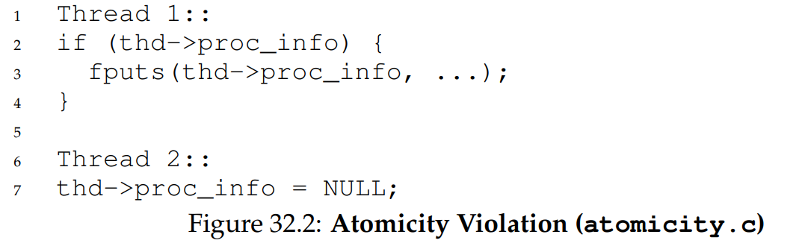

- Two different threads access the field `proc_info`. This is a typical race condition. 

- The issue here is the desired serialisability is vilated - i.e. intended to be atomic but atomicity is not enforced during execution.

- The problem here can be fixed by putting a lock.

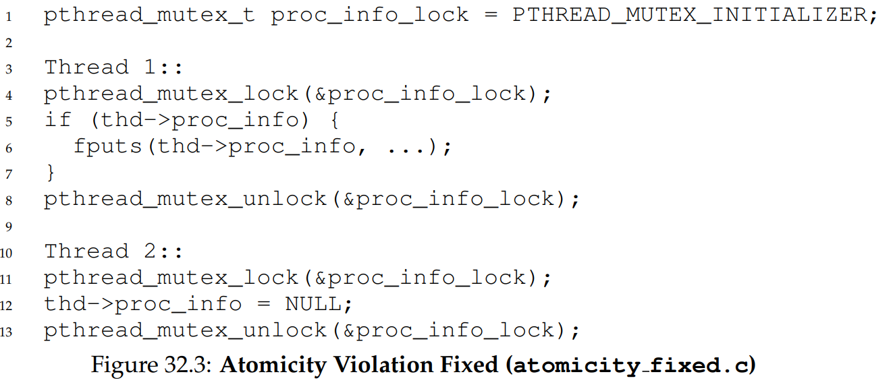

### Order violation bug 

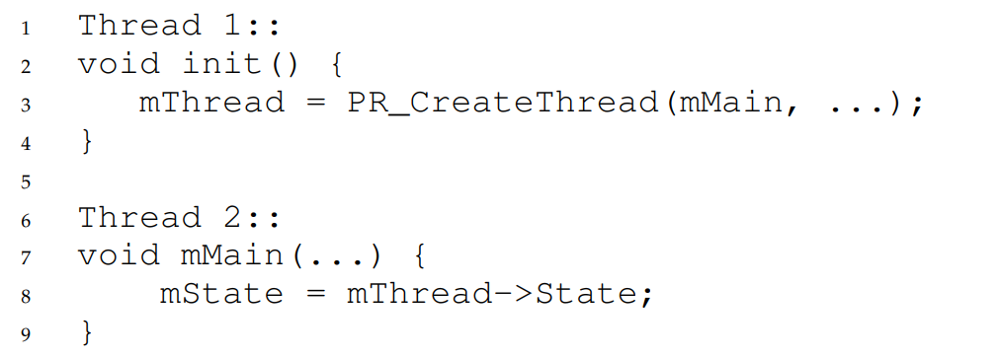

- Issue here is thread 2 assume thread 1 has already created the thread. This is a conditional variable kind of problem.
- The desired order between two groups of memory accesses is flipped. - i.e. A should be executed before B but the order is not enforced during execution. 

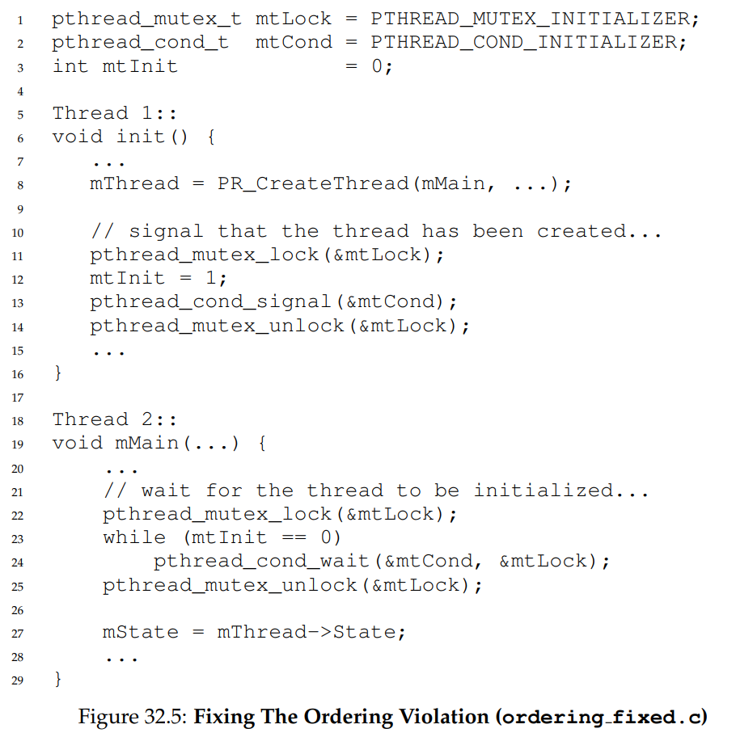

## Deadlock Bugs

- Occurs when a thread is holding a lock waiting for another thread. Unfortunately, thread 2 holds lock L2 is waiting for L1 to be released. Example:

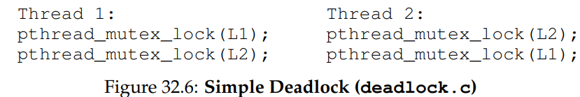

The deadlock dependency graph is shown: 

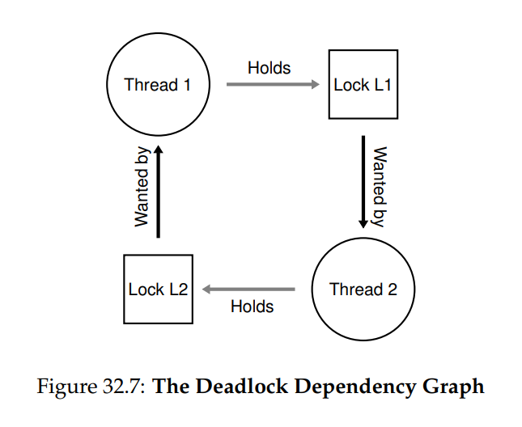


## Causes of deadlock:

- Complex dependencies between components
- Encapsulation - hide implementation details which does not mesh well with locking. 

Example:

```Java
Vector v1, v2;
v1.AddAll(v2);
```

This program tries to be thread safe, hence there are locks for both `v1, v2`. If another thread tries to call `v2.AddAll(v1)`, this could create a deadlock with the same dependency graph in the previous section. 

## Conditions for deadlock to occur:

- Mutual Exclusion: threads claim exclusive control of resources they require.
- Hold-and-wait: thread hold resources allocated to them while waiting for additional resource.
- No preemption: resources cannot be forcibly removed from threads holding them.
- Circular wait: there is a circular chain of threads such that each thread holds one or more resources that are being requested by the next thread in the chain. 

## Preventions:

### Circular wait

- Provide a `total ordering` on lock acquisition: if there are only 2 locks (L1, L2) prevent deadlock by always acquiring L1 before L2. Strict ordering ensures no cylical wait and hence no deadlock. 
- When there are multiple lock present, strict ordering can damage performance. Hence `partial ordering` can be used to avoid deadlock. 

### Hold and wait 

- Avoided by acquiring all locks at once. For example: 

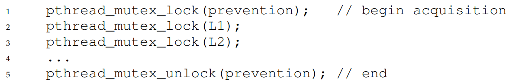

- Not really recommended for performance reasons. 
- Also issues with encapsulation - this requires knowing exactly which lock to hold to prevent deadlock. 


### No pre-emption

Happens when a thread holds a lock but is waiting for another lock. As such, some functionality to release the current held lock if the attempt to acquire a new lock does not succeed. 

`pthread_mutex_trylock` either grabs the lock if available and return suceess or return an error code indicating the lock is held. In the later case, we can try again later:

```C
top:
    pthread_mutex_lock(L1);
    if (pthread_mutex_trylock(L2)!=0){
        pthread_mutex_unlock(L1);
        goto top;
    }
```

- A new problem arise: `livelock`.
- If another thread attemps this sequence but in a different order - i.e. L2 then L1, both threads could try and fail to acquire both locks.
- Since the program does not halt, but no progress is made, this is a livelock. 
- A solution to this is to wait for sometime then retry the sequence. 
- Note that when restoring the state, make sure to release any resource acquired. 

### Mutual-exclusion

- Avoid the need for mutual exclusion at all.
- Use `lock-free` and `wait-free` data structures. 
- The idea is to use powerful hardware instructions that build data structures in a manner that does not require explicit locking. 

Example, assume we have a compare and swap hardware assisted instruction as follows:


We can implement an atomic increment function as follows: 

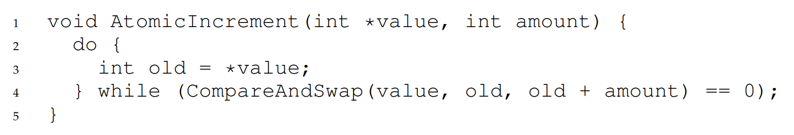

No lock is acquired and no deadlock can arise. Though livelock is still a possibility. 

Another example - list insertion:

```C
void insert(int value){
    node_t *n = (node_t*) malloc(sizeof(node_t));
    assert (n!=NULL);
    n->value = value;
    n->next = head;
    head = n;
}
```

This code performs simple insertion, but can have a race condition if called by multiple threads at the same time. We can implement a lockfree aproach as follows: 

```C 
void insert(int value){
    node_t *n = (node_t*) malloc(sizeof(node_t));
    assert (n!=NULL);
    n->value = value;
    do{
        n->next = head;
    }while(CompareAndSwap(&head, n->next, n)==0);
}

```

## Deadlock avoidance via scheduling 

In some scenario, avoidance is preferred. Requires global knowledge of which locks various threads might grab during their execution and subsequently schedules said threads in a way to guarantee no deadlock can occur. Assuming we have a lock requirement for 4 threads as follows:

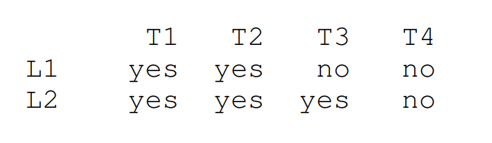

A scheduler could compute that as long as T1 and T2 are not run at the same time, no deadlock could arise. One schedule is this: 

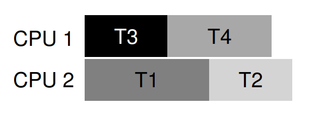

Note that T1 and T3 or T2 and T3 can overlap since they dont cause a deadlock to happen. 

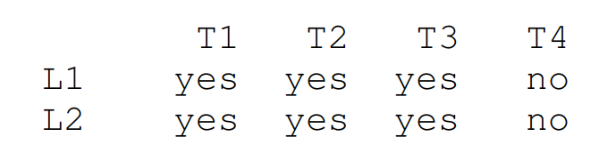

Here T1, T2, T3 cannot run at the same time. Hence a schedule is: 

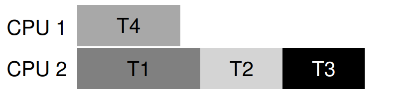

- Note that static scheduling like this is quite conservative. Thread 1, 2, 3 are all run on the same processor for fear of a deadlock. 
- The cost is performance.
- Avoidance of deadlock via scheduling is not generally a widely used solution.

## Detect and Recover 

Allow deadlock to occasionally occurs and then take some actions once such a deadlock has been detected. If deadlocks are rare, this is quite pragmatic. 
