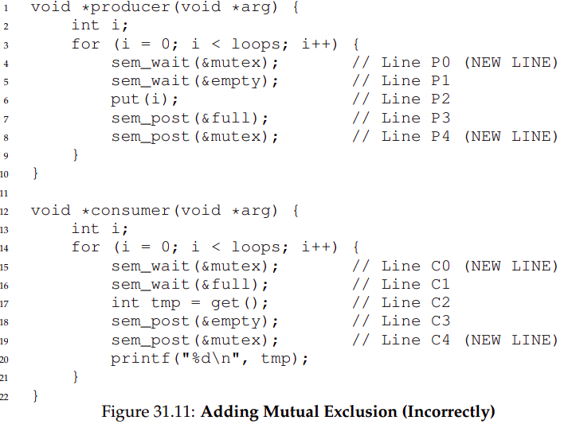

## Semaphore 

Semaphore is an object with integer value. 

- `sem_wait`
- `sem_post`

Before calling other routines, a semaphore value must first be initialised:

```C
#include <semaphore.h>
sem_t s;
// The second parameter indicates semaphore is shared between all threads in the same process
sem_init(&s, 0 , 1); // initial value set ot 1

sem_wait(&m);
// critical section
sem_post(&m); 
```

`sem_wait` semantic: decrease semaphore value by one and wait if value is negative. `sem_wait` may return immediately if semaphore value is positive. Otherwise it will wait for subsequent post. When semaphore value is negative, it is equal to the number of waiting threads. 

`sem_post` semantic: increase semaphore value by one and if there are one or more threads waiting, wake one. 

## Using semaphore as a lock:

The code for using semaphore as a lock is shown below:

```C
#include <semaphore.h>
sem_t s;
// The second parameter indicates semaphore is shared between all threads in the same process
sem_init(&s, 0 , 1); // initial value set ot 1

sem_wait(&m);
// critical section
sem_post(&m); 
```

Assuming two threads in a single processor CPU, thread 1 executing `sem_wait` before thread 2. Since semaphore value is 1, thread 1 can enter the critical section. There can be two scenarios:

- Thread 1 completes the critical section, then calls `sem_post`, which reset semaphore value to 1. Thread 2 now calls `sem_wait` then enter the critical section.
- Thread 1 is interrupted by the OS, which switches to thread 2. Thread 2 calls `sem_wait` and goes to sleep. Control is handed back to thread 1 which now executes the critical section and calls `sem_wait`. `sem_wait` wakes up Thread 2, which executes the critical section. 

## Using semaphore as a conditional variable

Imagine a thread creates another thread then wait for it to finish: 

```C
#include <semaphore.h>
sem_t s;

void *child(void* arg){
    printf("child\n");
    sem_post(&s);
    return NULL;
}

int main(){
    sem_init(&s, 0, 0);
    printf("parent created\n");
    pthread_t p;
    pthread_create(&p, NULL, child, NULL);
    sem_wait(&s);
    printf("parent completed\n");
    return 0;
}
```

We have the following scenarios:

- Parent reaches `sem_wait`, which is put to sleep. Child thread wakes up, execute the `child` function, which wakes the parent thread through `sem_post`.
- Child thread is switched over immediately when `pthread_create` is called, which completes the child function and set semaphore value to 1 without waking any other thread. The parent thread is switched over, which is returned immediately when calling `sem_wait`. 

## The producer consumer problem 

### A problematic solution 1:


This setup works for MAX=1. However, when MAX > 1 and we have multiple producers, the setup no longer works. This is because of a race condition that happens at `put` and `get`. We can construct a scenario using two producers trying to perform a put at the same time:

```
fill = 0

Thread1                         Thread2
buffer[fill] = value1 // Replace buffer[0]          
                                buffer[fill] = value2 //buffer[0]
                                fill = (fill + 1)% MAX
fill = (fill+1)%MAX

```

### A problematic solution 2:



Here a solution is to put a lock before the put and get operation. However, the implementation in Figure31.11 can lead to deadlock. Assuming a consumer thread trying to consume the buffer: it first acquires the mutex lock, then sleep when calling `sem_wait`. Since the mutex lock is not released, no other consumer can perform a `put` operation, causing deadlock. 

### A complete solution:


This is done by switching the lock around, checking for the full and empty condition before acquiring the lock. 

## Read-writer lock 


The idea here is multiple concurrent read is allowed, but while there are reading threads, there can be no writing. Writing lock is only released when the last reader stops reading. 

There is a problem with fairness: writer thread can be starved by the number of reader threads. 

## The Dinning Philospher:


There are 5 philosophers with 5 forks. When a philosopher eats, he needs both the left and right fork. The problem is to coordinate the action of the philosopher. 

- The broken solution is for each philosopher to poll for the fork on the left then for the fork on the right. However, this could lead to deadlock. Assuming the philosophers acquires sucessfully the fork on the left - i.e Pi acquires fi sucessfully. Pi now sleeps when trying to acquire f(i+1), which means all Pi will go to sleep without ever waking up. 

- The solution is to have one P breaks the mold. That is if every other Philosopher checks left then right, we can have one check right then left. 

## How to think about the semaphore number:

The value represents the resource that we are willing to give at the start. For lock, we want only one thread to be able to acquire it -> set value to 1. For condition variable, we want one thread to wait for another -> set to 0. If there is a memory intensive section that we want to limit the number of threads that can enter the section, set the semaphore number to the desired thread count. 

## Implementing semaphore using thread and condition variable: 

