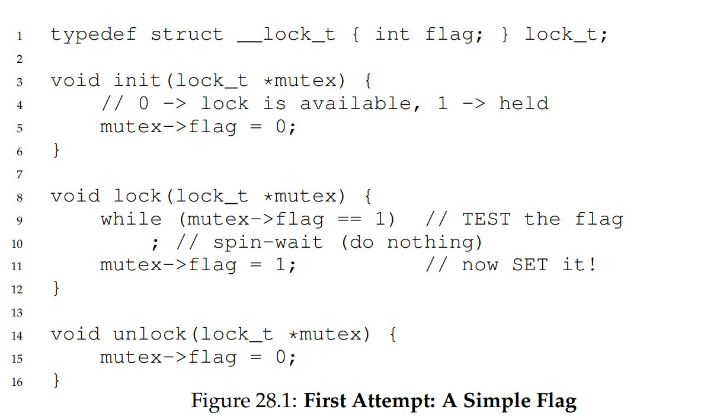
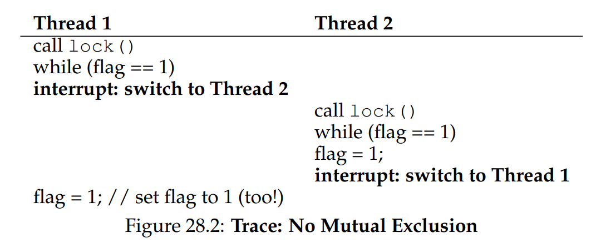
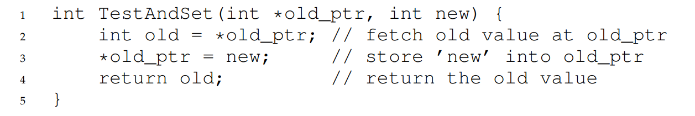
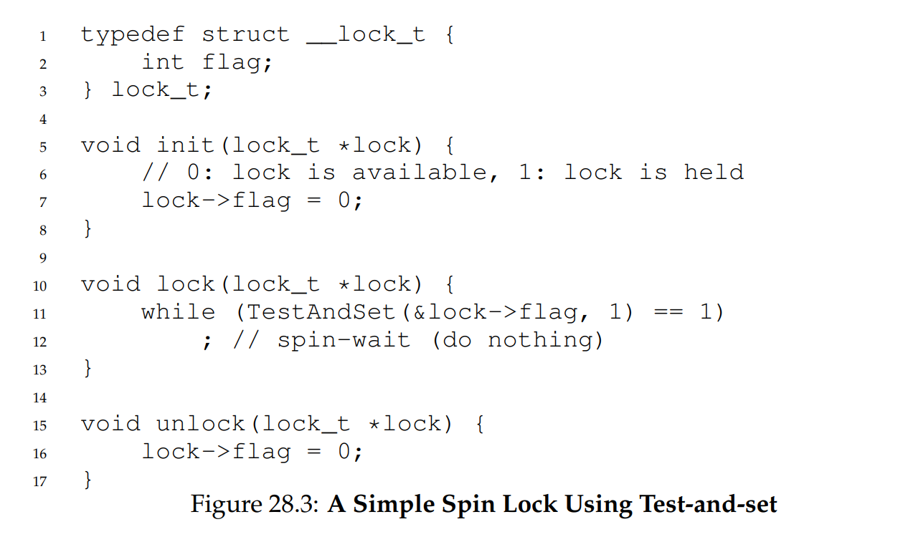
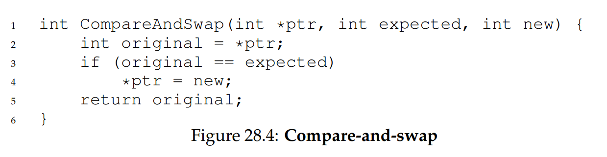
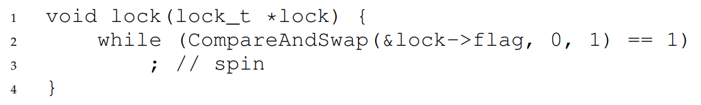
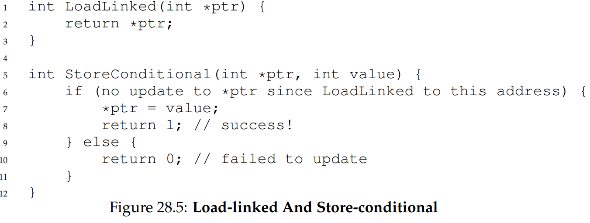
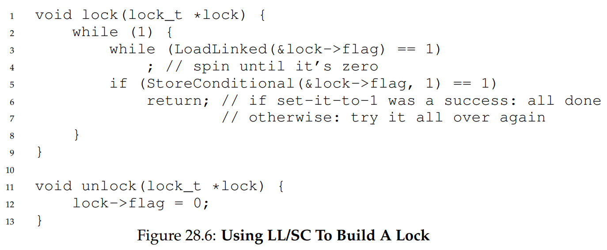
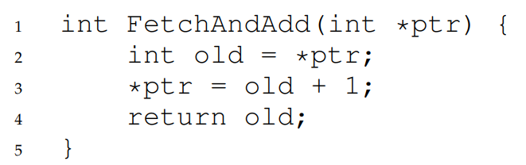
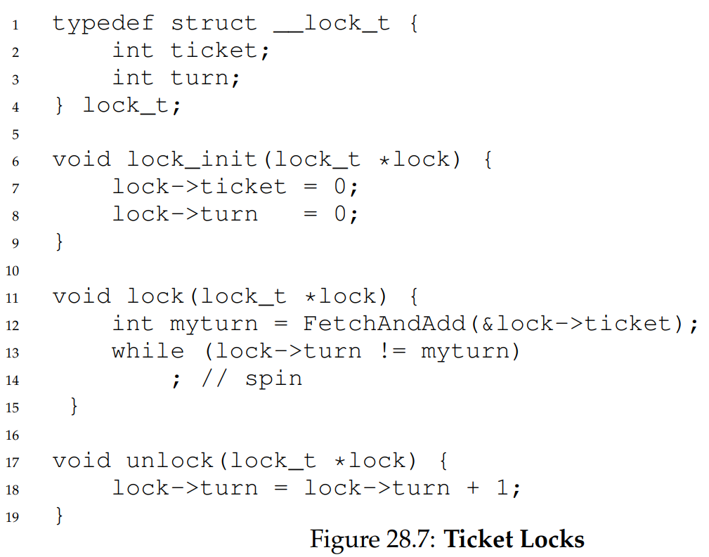

# Locks 
## Basic Idea 

- Lock is used to ensure that only one thread can enter a critical section. A lock is:
    - a variable that
    - holds the state of the lock (locked/unlocked)

- Lock can contain other information, but they are hidden from user of the lock:
    - what thread holds the lock 
    - Queue for ordering lock acquisition
- Two routines: `lock` and `unlock`
    - Calling `lock` tries to acquire the lock:
        - If the lock is free -> acquired (become the owner of the lock)
        - Otherwise -> fails
    - Calling `unlock` release control of the lock (called by owner)

## Coarse-grained vs fine-grain locks

- Coarse-grained: one big lock used anytime a critical section is assessed.
- Fine-grained: protect different data and data structures with different locks. 

## Evaluating Locks:

- Whether the lock provides mutual exclusion
- Does any thread contending for the lock starve and never obtain it. 
- Performance:
    - When there is just a single thread running, grabbing and releasing the lock.
    - When there are multiple threads contending for the lock on a single CPU. 
    - When there are multiple CPUs involved. 

## Building Locks:

### Solution - Controlling Interrupt:

- Disable interrupts for critical sections. Invented for single-processor systems.
- How it works: since interrupts are disable, the OS can not schedule any other thread while the current thread enters the critical section. This ensures only one thread can enter the critical section.
- Why is it good:
    - Simple 
- Why is it bad:
    - Disabling interrupt requires special privillege hence the OS will need to trust the running program to do the right thing, which is vulnerable to exploit:
        - A lock is never released or the OS never regains control of the system. 
    - Does not work on multiprocessor. If multiple threads are on different processors, each trying to enter the critical section, they can all enter the critical section even if interrupts are disabled. 
    - Interrupts information being lost - i.e. an IO operation is completed, etc. 
    - Inefficient. 
- Usage:
    - Very limited contexts as a mutex primitive.
    - An OS itself use interrupt masking to guarantee atomicity when accessing its own data structures or prevent messy interrupt handling situations.
    - No trust issue as the OS is the one performing the privillege operations. 

### Soluition - Using loads/stores 

- Use a simple `flag` to indicate whether a lock has been acquired.
- When a thread enters a critical section:
    - Call `lock()` which tests whether `flag==1`. 
    - If `False` (the lock is free):
        - Then sets `flag=1` to indicate that it has been acquired.
        - When finished, call `unlock()`, which set `flag=0`
    - If `True` (the lock is acquired):
        - Then spin-wait until the condition is successful. 

- Why is it bad:
    - Correctness:
        - Possible for both threads to set the flag to 1 and thus both enter the critical section (Figure 28.2)
    - Performance:
        - While spin-waiting, the waiting thread cannot do any useful work. 

### Solution - Using Test-And-Set (Spin Lock)

Need to use hardware support for locking. The equivalent C code for a Test-And-Set instruction is provided: 

- `lock()` sets the new flag value to 1 while checking the old value of flag:
    - If the flag was previously acquired, nothing is changed, the thread calling `lock` spin-waits.
    - If the flag was free, its flag is now 1, indicating it has been acquired. The while condition breaks, and the calling thread enters the critical section. 
- The difference compared to the `load/store` solution is the comparison check and setting of flag value are now a single atomic operation, which means there can be no interleaving of set and test. 

- Special preemptive scheduler is required on a single processor: one that will interrupt the thread via a timer in order to run a different thread. Without scheduling, a thread spining on a CPU will never relinquish it. 

#### Evaluating Spin Lock:
- Correctness: yes it provides mutual exclusion
- Fairness: no fairness guarantee. A thread spinning may spin forever under contention. Starvation may happen.
- Performance: 
    - On a single CPU processor:
        - Assuming there are N threads trying to acquire the lock:
            - Only 1 thread acquires the lock and do productive work in its timeslice.
            - N - 1 other threads spin-wait in their time-slices, effectively wasting CPU cycles. 
    - On multi-processors CPU:
        - If the number of threads ~ number of CPU processors, can be effective. 
        - Assume 2 processors, and two threads A and B entering the critical section:
            - A does productive work while B spin-waits.
            - The computer still does productive work in this cycle. 

### Solution: Compare-And-Swap

- Also use hardware support 
- Additional variable expected

The `lock` routine is similar to Test-And-Set:

Behaviour is similar to Test-And-Set, but is useful for `lock-free-synchronisation`. 

### Solution: Load-linked and Store-Conditional: 

- Platform-specififc instruction 
- Addressed the failure situation shown in Figure 28.2. 
    - When the lock is free and by some interrupt events, two threads arrive at line 5, only one can enter the critical section.
    - The `StoreConditional` ensures that if another thread has acquired the flag, the expression on line 5 evaluates to False. 

### Fetch-and-Add 

- Lock contains `ticket` which represents the thread whose id `myturn` can acquire the lock. 
- Lock primitive assign an id value `myturn` to a thread, who spin-waits until `lock->turn` is `myturn`, at which point it can enter the critical section.
- Unlock increments `lock->turn`. 
- The `FetchAndAdd` primitive ensures that each thread is assigned a unique id. 
- The difference between `FetchAndAdd` and other solutions is this ensures every thread can take a turn at the critical section (fairness). 